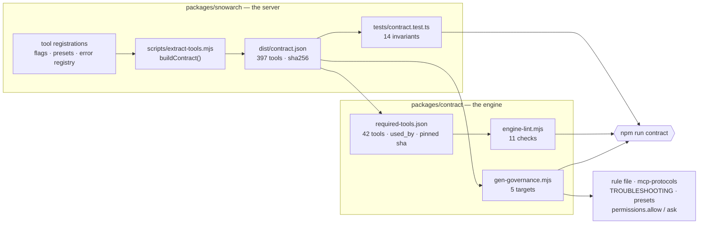

# ARCHITECTURE.md — target repository layout

> **Stub.** ARC-01-S01 writes this file so that reviewers of ARC-01-S02…S12 have the target in front of
> them while files are being moved into it. **ARC-01-S12 replaces it** with the full architecture
> document. The tree below is `docs/plans/01-TARGET-ARCHITECTURE.md` §3 **verbatim** — that document
> remains the source of truth; this is a convenience copy, and if the two ever disagree, `01` wins.

## The target tree

```
ai-servicenow-architect/                      farstic/ai-servicenow-architect · one git tag per release
├── CLAUDE.md                                 ≤200 lines: identity, routing protocol (Phase 1/2), §1.1 summary, the `Status` trigger (→ `/snowarch status`); imports nothing large
├── README.md                                 the ONE install page (2 commands, 2 dialogs, what you will see)
├── LICENSE · NOTICE                          single licence (D-02); Apache-2.0 attribution for ServiceNow/ServiceNowDocs
├── engine.config.json                        product name, server key, floors (claude/node/git), docs family+pin, roster expectations
├── package.json · package-lock.json          ROOT = version of record; workspaces ["packages/*", "tools/snowarch"]; scripts {bootstrap, doctor, test, lint, release}
├── bootstrap.sh · bootstrap.ps1 · bootstrap.cmd   launchers (bash 3.2 / PowerShell 5.1 / cmd → PowerShell with -ExecutionPolicy Bypass)
├── snowarch · snowarch.cmd                   post-install command launcher → node tools/snowarch/bin/snowarch.mjs "$@"
├── .mcp.json                                 COMMITTED, secret-free project-scope registration of server key "servicenow" (§5)
├── .gitmodules                               vendor/ServiceNowDocs · branch = australia · shallow = true
├── .gitignore                                .local/ clients/ node_modules/ .env .claude/settings.local.json .DS_Store Thumbs.db
├── .gitattributes                            *.mjs *.md *.json *.sh text eol=lf; *.ps1 *.cmd eol=crlf
├── .claude/
│   ├── settings.json                         COMMITTED team settings: env.MCP_TIMEOUT, SessionStart hook (exec form, node), generated permission allow-list (reads) and ask-list (mutating tools — the mechanical half of §2.1 under auto mode)
│   ├── rules/
│   │   └── 00-mode-and-mcp-gate.md           GENERATED from the contract: the §2.1 write gate (prefix, "write approved"), §2.2 capture sequence, Mode semantics (~40 lines, always loaded)
│   ├── skills/
│   │   ├── <27 specialist skills>/SKILL.md + EXAMPLES.md   single canonical copy; descriptions ≤ 500 chars (lint); triggers in body
│   │   ├── now-assist-genai/                 reference companion (28th SKILL.md)
│   │   └── snowarch/SKILL.md                 /snowarch status · setup-instance · doctor (R-2): quotes the doctor Mode line; guided front-end of the wizard (§6); roster from directory listing
│   └── agents/<9>.md                         single canonical copy; model: inherit; skills: [<persona>] preload; explicit tools lists (no MCP)
├── governance/
│   ├── governance/governance-rules.md                   §1.1, §2 (references the generated rule), §4 — read on demand as today
│   ├── governance/taxonomy.md · governance/prompt-patterns.md      read on demand as today
│   └── mcp-protocols.md                      GENERATED long form of §2.1/§2.2 with current tool names (the rule file is its digest)
├── packages/
│   ├── snowarch/                             the server + CLI package (from farstic/snow-mcp, server-only scope — ARC-04)
│   │   ├── package.json                      name @farstic/snowarch; version == root (lint); engines node>=20; runtime deps only
│   │   ├── src/                              server.ts, tools/, servicenow/, utils/, resources/, cli/ (instance · doctor · contract · start)
│   │   ├── dist/                             COMMITTED prebuilt output incl. tools-manifest.json and contract.json (CI rebuilds and diffs)
│   │   └── tests/                            vitest (server-scoped root), incl. contract.test.ts
│   └── contract/
│       ├── required-tools.json               41 tools = 35 engine-cited + snow_us_update_set_preview (§2.2 protocol) + 5 core, each {name, gate, mutates, used_by[]}; contractSha256 pin
│       ├── retired-names.json                copy of tool-rename-map.json keys — forbidden as bare words
│       └── lint/engine-lint.mjs              engine-side contract lint (§11)
├── tools/snowarch/                           ZERO-DEPENDENCY Node ESM CLI (node:fs, child_process, readline, https, crypto)
│   ├── bin/snowarch.mjs                      bootstrap | doctor | instance … | docs … | mode … | upgrade | version
│   ├── lib/steps/B00…B09.mjs                 one file per bootstrap step (idempotent; declares an inputs hash)
│   ├── lib/state.mjs                         .local/bootstrap-state.json read/write/resume
│   ├── lib/doctor/                           engine-side checks E-xx; merges server checks SV-xx from packages/snowarch
│   └── hooks/session-start.mjs               prints the Mode banner (<300 ms; reads .local/doctor-last.json)
├── vendor/
│   ├── ServiceNowDocs/                       submodule, checked out depth-1 + cone-sparse (§10)
│   └── docs-areas.txt                        GENERATED list of cited top-level areas (one per line; consumed by launchers and Node)
├── templates/                                ADR, RTM, RAID, NFR, HLD, Gherkin (merged)
├── docs/
│   ├── INSTALL.md (= README body) · MODES-AND-PRESETS.md · TROUBLESHOOTING.md (GENERATED) · PLATFORM-NOTES.md · ARCHITECTURE.md · CONTRIBUTING.md · CHANGELOG.md (GENERATED) · MIGRATION.md (ARC-10) · USER-GUIDE.md · CLIENT-ONBOARDING.md (ARC-02)
├── scripts/                                  MAINTAINER only: build-dist.mjs, release.mjs, gen-docs-areas.mjs, docs-bump.mjs, md-to-docx.py/.ps1, render-drawio.sh / render-diagrams.ps1, render-pdf.sh / render-pdf-pages.ps1
├── tests/                                    engine tests: roster lint, description-length lint, version-consistency, VALIDATION-TESTS.md (manual T-01…T-18)
├── .github/workflows/ci.yml · docs-bump.yml · release.yml
└── .local/                                   GITIGNORED per-checkout state: instances.json (0600) · config.json · bootstrap-state.json · doctor-last.json · audit.jsonl · logs/
```

Not in the repository: any client engagement content (`clients/` stays gitignored and per checkout), `.claude/settings.local.json`, `.env`, the author's personal hook tooling (see the retired-name glossary below), the Electron desktop app, the other-client guides.

## Directory → owner ARC

Which programme increment first creates or populates each path. **Nothing is created empty**: git tracks
no empty directories, so a path appears in the repository only when its owner puts a file in it.

| Path | Owner | Notes |
|---|---|---|
| `LICENSE` · `NOTICE` · `docs/RELICENSING.md` | **ARC-01** (S01) | D-02; the relicensing sentence is in this commit's message |
| `docs/decisions/` | **ARC-01** (S01) | ADR-0001…0008, imported verbatim from the spike workspace |
| `docs/spikes/` | **ARC-01** (S01) | ARC-00's spike records, stub server, recipes, hooks, licence working files |
| `engine.config.json` | **ARC-01** (S01) | from `spikes/engine.config.seed.json`; schema validated by ARC-01-S04 |
| `docs/ARCHITECTURE.md` | **ARC-01** (S01 stub → **S12** full) | this file |
| `CLAUDE.md` · `governance/` · `.claude/skills/` · `.claude/agents/` · `templates/` · `scripts/` | **ARC-02** | engine consolidation; imported with history |
| `README.md` · `.gitignore` · `.gitattributes` | **ARC-01** (S02 import, S07 replace) | the engine's own files arrive first, then are replaced |
| `vendor/ServiceNowDocs` · `vendor/docs-areas.txt` · `.gitmodules` | **ARC-03** | docs corpus; recipe C **plus the root-file repair step** (ADR-0008) |
| `packages/snowarch/` | **ARC-04** | the MCP server and its CLI |
| `packages/contract/` | **ARC-05** | required-tools, retired-names, engine-lint |
| `.claude/settings.json` · `.claude/rules/` | **ARC-05** | generated permission rules and the §2.1/§2.2 rule file |
| `bootstrap.sh` · `bootstrap.ps1` · `bootstrap.cmd` · `snowarch` · `snowarch.cmd` · `.mcp.json` · `tools/snowarch/` | **ARC-06** | bootstrap and registration |
| `tools/snowarch/lib/steps/` (instance wizard) | **ARC-07** | credentials; `.local/instances.json` at 0600 (D-04) |
| `tools/snowarch/lib/doctor/` · `tools/snowarch/hooks/` | **ARC-08** | doctor and self-heal |
| `.github/workflows/` · `package.json` · `package-lock.json` | **ARC-01** (S11) → **ARC-09** | CI first, then release and upgrade |
| `docs/MIGRATION.md` | **ARC-10** | migration and cutover |
| `.local/` · `clients/` | — | **gitignored, per checkout**; never committed |

## `docs status` and the `docsStatus()` shape

**Computed here, wrapped by ARC-08.** `tools/snowarch/lib/docs/status.mjs` answers whether the corpus
is present, pinned, on the right family, correctly sparse and fully cited. The doctor assigns check
ids, severities and `--fix` actions to what it returns, and `/snowarch status` quotes the doctor —
so there is one derivation of these facts, not three. It never touches the network; `--fetch` is
ARC-03-S07's.

```
docs corpus: vendor/ServiceNowDocs
  pin        ba513f2  gitlink ba513f2  HEAD ba513f2            ok
  family     australia  branch australia                       ok
  checkout   sparse (cone), 19/19 areas, 34,359 files, 179 MB  ok
  citations  checked: 180 | dead: 0                            ok
```

Divergences print `MISMATCH` in the last column with the remedy on the next line — `run node
scripts/docs.mjs sync`, except `pin ≠ gitlink`, which is a maintainer action
(`node scripts/docs-bump.mjs --to <gitlink>`, owned by S07/S09). An absent corpus prints one
`docs corpus: MISSING` block. Exit codes: **0** all ok · **1** any mismatch · **3** missing; `--json`
exits 0 unless the command itself failed, so a caller reading the object always gets the object.

**Schema v1.** Twenty keys, versioned so additions are non-breaking:

| Key | Meaning |
|---|---|
| `present` · `path` | is there a corpus, and where |
| `pin` · `gitlink` · `head` · `pinMatchesGitlink` · `headMatchesPin` | the three commits that must agree, and the two comparisons |
| `family` · `branch` · `familyMatches` | recipe C leaves a DETACHED head, so the family comes from the tracked branch, not from HEAD |
| `sparse` | `cone` · `full` · `pattern` · `none`. `pattern` is ADR-0008's shape — sparse on, cone off — reported separately because the remedy differs |
| `areasExpected` · `areasPresent` · `areasMissing` | against the generated areas file |
| `mode` | what was ASKED for (`.local/bootstrap-state.json`, written by ARC-06), inferred from the checkout when absent. `mode` and `sparse` can disagree, and both are reported: the disagreement is the finding |
| `fileCount` · `sizeBytes` | opt-in — a 35k-file walk costs about a second and does not belong in a hook's budget |
| `citations` | the S03 verify result, or `null` when `verify: false`. **The key is always present**, so a consumer distinguishes "not asked" from "asked and empty" |
| `longpaths` | `true`/`false` on Windows, `null` elsewhere — the setting does not exist there, and `false` would read as "off" |
| `schema` | `1` |

## The maintainer refresh, and the exit codes

`node scripts/docs.mjs sync --upstream [--to <sha>] [--json] [--no-verify]` moves the pin forward
and shows what it broke. Five things happen, in this order and no other:

1. **Refuse a dirty tree outside `vendor/`** — before any network call. A dirty *corpus* does not
   block it: that is `sync`'s refusal, and this command is about to move the corpus anyway.
2. **Fetch** the family branch, or the named SHA.
3. **Verify at the current pin** — the baseline. It has to run before the move, because "which
   citations *became* dead" is a difference between two states and the first one stops existing the
   moment the corpus moves.
4. **Move and verify again**, sparse set untouched.
5. **Write the pin and stage** `engine.config.json` and `vendor/ServiceNowDocs`. **Nothing is
   committed.** A human reads the report and decides.

The pin write replaces one 40-hex string in the file rather than reparsing it, so the diff a
reviewer reads is one token, not a reformat. An upstream that rewrote history can leave the tip
*behind* the current pin: the command follows it and says `(older than the current pin)` on the pin
line, because silently staying put would hide the rewrite.

The report's headings are a contract — ARC-03-S09's workflow pastes them verbatim into a pull
request body and keys on **exit 1** meaning "the pin moved and citations broke, someone must remap".

### Switching release family

`node scripts/docs.mjs family <name> [--dry-run | --yes] [--from <name>]` — the dry run **is** the
proposal (principle 10), and `--yes` applies exactly what it printed.

1. **Validate and look upstream.** `ls-remote --heads` needs the network even for a dry run, and the
   output says so. A branch that is not there exits 6 with S07's sentence.
2. **Plan.** `.gitmodules`, `engine.config.json`, the schema enum when the target is new, and every
   prose line whose *only* family mention sits inside the phrase set. A line with any other mention
   goes to **REVIEW** whole: half a sentence about the new family and half about the old is worse
   than a line nobody touched.
3. **Apply, pin first.** The pin moves against the new branch while the tree is still clean, so
   S07's dirty-tree refusal still guards the whole operation instead of tripping on this command's
   own edits.
4. **Re-lint and stage.** A failing lint exits 1 with everything staged — the maintainer needs the
   edits in order to fix what the lint caught — and the last two lines say how to finish and how to
   abandon.
5. **Never commits.** History (`docs/plans`, `docs/spikes`, `docs/decisions`, the changelog,
   RELICENSING) is never scanned, listed or edited: it records what was true when it was written.

### The weekly bump

`.github/workflows/docs-bump.yml` (Mondays 05:17 UTC, plus `workflow_dispatch` with `to` and
`dry_run`) runs the refresh on a clean runner and opens **one** pull request — branch
`chore/docs-bump-<short>`, stable per target SHA, so a re-run updates rather than duplicates and a
newer tip closes the older PR as superseded. `scripts/docs-bump.mjs` is a thin wrapper: it renders
the pull-request body from S07's report **verbatim inside a fence** and decides nothing. Labels are
`docs-corpus`, plus `needs-remap` when a citation broke.

**It never merges.** A bump changes what every gateway skill is grounded in; the PR's own CI goes red
on a dead citation and stays red until a human remaps it. A **dry run** exits 0 with the body in the
log and a `::warning::` for newly dead citations — reporting is its job, and the red build belongs on
the pull request where someone can act on it. Exit 6 fails the job loudly; exit 4 cannot happen on a
fresh checkout and is treated as a bug in the recipe if it does.

### Exit codes — every `docs` sub-command shares one table

| Code | Meaning |
|---|---|
| **0** | ok |
| **2** | a plan was printed and not applied — `family <name>` without `--yes` |
| **1** | `sync`: the checkout is incomplete · `--upstream`: the pin moved **and** citations broke · `verify`: dead citations · `status`: a mismatch |
| **3** | the corpus is missing |
| **4** | the working tree is not clean — nothing was touched |
| **5** | git failed; the message says how (DNS · proxy · TLS · unfetchable pin · disk) |
| **6** | the upstream does not have what was asked for — a renamed family branch, or an unreachable SHA |

4 and 5 are deliberately distinct: one is "you have unsaved work", the other "the transport failed",
and a caller that collapsed them would send someone to check their network over an unstaged edit.
6 is narrower still — neither the operator's fault nor a transport failure, and its remedy is to
find out what the branch is called now.

## The git-only corpus recipe

ARC-06's launchers run this when Node is absent — `bootstrap.sh` on bash 3.2 (macOS ships it) and
`bootstrap.ps1` on PowerShell 5.1. It is the **only** git-only sequence, and it is not a paraphrase
of what `tools/snowarch/lib/docs/sync.mjs` does: `tests/docs-recipe.test.mjs` asserts this block is
byte-identical to `node scripts/docs.mjs sync --print-recipe --mode sparse` on a tree with no
checkout, which is the launcher's situation. Edit the module, regenerate, paste; never the reverse.

The area list is one long line on purpose. `sparse-checkout set --cone` takes the directories as
arguments, and a wrapped or reordered list is a different checkout.

```sh
git clone --filter=blob:none --no-checkout --depth 1 --sparse --branch australia https://github.com/ServiceNow/ServiceNowDocs.git vendor/ServiceNowDocs
git -C vendor/ServiceNowDocs sparse-checkout set --cone markdown/api-reference markdown/application-development markdown/build-workflows markdown/core-business-suite markdown/customer-service-management markdown/employee-service-management markdown/governance-risk-compliance markdown/integrate-applications markdown/intelligent-experiences markdown/it-asset-management markdown/it-business-management markdown/it-operations-management markdown/it-service-management markdown/now-intelligence markdown/now-platform markdown/platform-administration markdown/platform-security markdown/platform-user-interface markdown/servicenow-platform
git -C vendor/ServiceNowDocs fetch --depth 1 origin ba513f2c62d3698ef5bfdd8044110226b8419689
git -C vendor/ServiceNowDocs checkout --detach ba513f2c62d3698ef5bfdd8044110226b8419689
git submodule absorbgitdirs vendor/ServiceNowDocs
git submodule init -- vendor/ServiceNowDocs
```

Then the launcher checks only that each line of `vendor/docs-areas.txt` exists as a directory under
`vendor/ServiceNowDocs/markdown/`, and prints `citations: not verified until Node 20+ is installed`
— citation verification needs the corpus reader, which needs Node.

**On Windows the sequence above gains one line**, and the PowerShell launcher must run it after the
clone — a single block cannot be byte-identical on both platforms, so this one is the POSIX form:

```powershell
git -C vendor/ServiceNowDocs config core.longpaths true
```

The module also adds `-c core.longpaths=true` to every git call it makes on `win32`. ARC-00 S-07 acceptance criterion 2 was **refuted** — every recipe passed on
`windows-latest` with the setting off, because the longest corpus path (197 characters) plus a
checkout prefix still fits in 260. It is kept for the margin, not for a failure anyone can
reproduce today; the reasoning is in the module so it is not removed as dead weight.

## Roster

Generated from the directory listing by `scripts/gen-roster.mjs`, and checked by `npm run lint`.
Five documents used to disagree about these numbers, and every one of them was true when it was
written (P-12) — so nothing here is typed. Edit a skill or an agent and re-run the generator;
never edit between the markers.

<!-- ROSTER:BEGIN (generated by scripts/gen-roster.mjs — do not edit) -->

**27 specialist personas · 28 skills (incl. now-assist-genai reference companion) · 9 sub-agents**

### Skills

| Skill | Fires as | Sub-agent | Version |
|---|---|---|---|
| `app-engine-specialist` | on demand | — | 1.1.0 |
| `atf-author` | post-build consult | yes | 1.1.0 |
| `cmdb-csdm-specialist` | gateway | — | 2.0.0 |
| `code-reviewer` | post-build consult | — | 1.0.0 |
| `csm-specialist` | gateway | — | 2.0.0 |
| `developer` | builder | yes | 1.0.0 |
| `devops-release-manager` | routing-time consult | — | 1.1.0 |
| `diagramming-specialist` | post-build consult | yes | 1.0.0 |
| `discovery-specialist` | on demand | — | 1.1.0 |
| `estimation-specialist` | on demand | — | 1.0.0 |
| `flow-designer-specialist` | builder | yes | 1.0.0 |
| `hld-lld-writer` | builder | yes | 1.0.0 |
| `hrsd-specialist` | gateway | — | 2.0.0 |
| `integration-specialist` | builder | yes | 1.0.0 |
| `itom-discovery-specialist` | gateway | — | 2.0.0 |
| `itsm-specialist` | gateway | — | 2.0.0 |
| `licensing-specialist` | routing-time consult | — | 1.0.0 |
| `migration-specialist` | on demand | — | 1.0.0 |
| `now-assist-genai` | reference | — | 1.0.0 |
| `now-assist-specialist` | builder | yes | 1.0.0 |
| `operational-documentation` | post-build consult | — | 1.0.0 |
| `performance-scale-specialist` | routing-time consult | — | 1.0.0 |
| `reporting-analytics-specialist` | on demand | — | 1.1.0 |
| `security-grc-specialist` | routing-time consult | — | 1.1.0 |
| `spm-specialist` | on demand | — | 1.1.0 |
| `story-writer` | builder | yes | 1.0.0 |
| `technical-designer` | builder | yes | 1.0.0 |
| `ui-ux-specialist` | on demand | — | 1.1.0 |

### Sub-agents

| Agent | Preloads | What it does |
|---|---|---|
| `atf-author` | `atf-author` | Generate a batch ATF (Automated Test Framework) test suite across an entire scoped ServiceNow app per a supplied app scope and spec. |
| `developer` | `developer` | Implement ServiceNow code (Script Includes, Business Rules, Client Scripts, UI Scripts, Scheduled Jobs, Background Scripts, Fix Scripts, custom Flow Action scripts) per a supplied spec. |
| `diagramming-specialist` | `diagramming-specialist` | Generate diagrams for a ServiceNow design from a supplied spec — one figure or a full pack of context/C4, ERD, sequence, swimlane, state, deployment, CSDM/CMDB map and roadmap/Gantt/RACI. |
| `flow-designer-specialist` | `flow-designer-specialist` | Design Flow Designer flows, subflows, custom Actions, and decision-table-driven branching per a supplied requirement. |
| `hld-lld-writer` | `hld-lld-writer` | Produce ServiceNow High-Level Design (HLD), Low-Level Design (LLD) or Process Design Document (PDD) artefacts. |
| `integration-specialist` | `integration-specialist` | Design integration architecture between ServiceNow and external systems — outbound REST/SOAP, inbound Scripted REST APIs, IntegrationHub spokes, MID Server topology, authentication, retry/DLQ patterns, payload security — per a supplied requirement. |
| `now-assist-specialist` | `now-assist-specialist`, `now-assist-genai` | Design ServiceNow Now Assist AI capabilities — AI Agents, agentic workflows, Now Assist skills, Virtual Agent topics, AI Search, AI Control Tower governance, prompt engineering, confidence routing, human-in-loop gates. |
| `story-writer` | `story-writer` | Convert requirements into sprint-ready Gherkin Feature files with ServiceNow conventions, OPEN QUESTIONS blocks, and proposed supporting stories. |
| `technical-designer` | `technical-designer` | Produce ServiceNow component design specifications — table model, field types, ACL matrix, business rule list with a rationale per item, client-side logic, flow outline, integration touchpoints, performance and security considerations, test strategy. |

### Utility skills

| Skill | Version |
|---|---|
| `snowarch` | 2.0.0 |

<!-- ROSTER:END -->

## Sub-agents

The sub-agents under `.claude/agents/` — counted in the roster block above — hold three invariants,
each enforced by a rule in `tests/agents-lint.test.mjs`:

- **Explicit `tools:`** (AG-03). Every agent lists its tools. An agent with no `tools:` key inherits
  *everything* the session has, MCP tools included — so the list is what structurally prevents a
  builder from touching a live instance (principle 8, DR-13).
- **`model: inherit`** (AG-04). No agent pins a model id. A pinned id rots as models change (P-10),
  and a dispatched agent should run on whatever the session runs on.
- **`skills:` preload** (AG-05). The persona arrives in the sub-agent's context through frontmatter,
  not by reading `SKILL.md` from disk. `EXAMPLES.md` is *not* preloaded, so agents still read it
  explicitly — verified in the ARC-02-S04 regression: the sub-agent read `SKILL.md` before the change
  and only `EXAMPLES.md` after it.

## Engine

**Audience split.** This document is for people changing the repository. The engine's own operating
rules — how the Chief Architect routes, what each specialist owns, what a builder must return — live in
`CLAUDE.md` and `governance/`, and are read by the model at runtime, not by a maintainer at design time.

### The contract: who generates, who pins, what fails



**The invariants that make it hold** are `packages/snowarch/tests/contract.test.ts` 5–8: the flag set is closed — the
contract, `permissions.ts` and every preset name the same six (5); no preset turns a flag on while
its prerequisite is off (6); a mutating name mutates (7); and gate and `mutates` imply each other in
both directions (8). Exceptions to 7 and 8 exist only as named classes in
`packages/snowarch/tests/contract-exceptions.json`, each with a reason, each required to be
load-bearing.

**What fails, and where.**

| Change | Fails | Says |
|---|---|---|
| a tool renamed, engine not told | server tests 1, 7, 10, 13 · lint `L01`, `L08`, `L11` | `pinned but not registered — a rename the engine has not been told about` |
| a tool re-gated | server test 2 · lint `L08`, `L11` | `expected gate=scripting, contract declares gate=write` |
| a seventh flag added to the source only | server test 5 | `permissions.ts references a flag the contract does not declare` |
| a generated file edited by hand | `gen:check` · lint `L06` | `differs from generator output (gen-governance)` |
| a retired name written into prose | lint `L03` | `retired name "…" → use …` |
| the contract changed, the pin not updated | server test 13 · lint `L11` | `contract sha changed — on the engine side run node packages/contract/pin.mjs` |
| a name typed into engine tooling | `tests/contract/no-literals.test.mjs` | `read it from the contract loader, or add it to the allow-list with a reason` |

All of it is one command — `npm run contract` — which runs in CI on nine cells, before a release
tag, and on your machine.

**A distribution-channel move is one line.** Spike S-14 asked what changing the tool prefix would
cost if the product moved to a plugin channel: `engine.config.json`'s `mcp.serverKey`, then
`npm run gen`. The prefix appears exactly once in the always-loaded rule file and once in the
long-form document, both rendered from that key, and `L02` fails on any other spelling — so the
answer is a configuration change and a regeneration, not a sweep.

**Engine tooling reads the contract through `packages/contract/lib/contract.mjs`.** Stdlib only,
zero dependencies, importable before `npm ci` — because ARC-06's bootstrap and ARC-08's doctor both
run in a checkout that has installed nothing yet. `loadContract({ root, verifyPin })` is the only
function that touches the filesystem and throws `ContractPinMismatch` carrying both shas; everything
else is a pure function of the object it returns: `flags`, `flagNames`, `presets`, `expandPreset`
(which enforces the dependency rule and names the offending pair), `tools`, `toolNames({ mutates })`,
`askList` (`mutates || sessionMutates` — one definition, shared by the permission block, the rule
file's count and the doctor), `unsupportedTools`, `alsoRequires`, `errorCodes`, `remedyFor`,
`prefix(config)` and `updateSetCaptureSequence`. `tests/contract/no-literals.test.mjs` is the other
half of the rule: no engine tool holds a flag name, a preset name or an error code of its own.

**A tool's contract entry carries `unsupported: true` when no REST endpoint backs it.** Two do —
the script-execution stubs — and they stay registered so a refusal can name the route that works
instead of reading as a misspelling. The generated rule file filters on that flag; before it
existed, the file named the two tools from a literal, which is a claim about the server made
from outside the contract.

**Mode and preset are the two axes of what a session may do**, and they are documented once, in
`docs/MODES-AND-PRESETS.md`: what `design-only` and `live` mean, what each of the four presets turns on,
what each of the six flags does in plain language, and how a `prod` instance is protected. Nothing about
those semantics is restated here — a second copy is the thing that drifts.

**The routing protocol has two phases and the gateways fire in both.** Phase 1 is routing-time: restate
the task, read engagement context, surface assumptions, evaluate the §1.1 Baseline-First rule, and — if
the task touches a domain a Domain Expert gateway covers — produce that gateway's 5-Part Constraint
Envelope before any builder is dispatched. Phase 2 is post-build: hold the returned artefact, inspect it
for §1.1 violations, re-fire the same Domain Expert in review mode against the Envelope, then evaluate
the post-build consults. **The gateways fire twice per request** — Phase 1 Step 5 and Phase 2 Step 4 —
and that is what stops a builder quietly substituting a custom object for the baseline one the Envelope
named.

**The §6.2 hook** is the post-build consult evaluation: a returned artefact containing a JavaScript block
proposes a Code Reviewer pass; a release-path artefact proposes ATF coverage; a go-live signal proposes
operational documentation; a design artefact proposes diagrams. The proposal is mandatory even though the
user may decline it — skipping the proposal is the architectural defect, not declining it.

**§1.1 Baseline-First** is the most consequential rule: no custom table, scoped app, state extension or
other major custom architectural object without explicit approval, and **the user's original request does
not constitute that approval**. A gateway that cannot map a request onto a baseline construct returns
Verdict C and the dispatch halts — no design artefact is produced in the same turn as the open question.

**The roster** — how many skills and agents ship, and what each one is — is generated from the tree
rather than restated here; see the roster block (ARC-02-S07) and `engine.config.json`.

**Live-instance execution** adds two gates in a fixed order: the write-approval gate, then update-set
capture. Both are stated normatively in `governance/mcp-protocols.md` (ARC-05); a mutating call without
an explicit approval in the current conversation halts, and a configuration write before the update-set
preference is set cannot be captured retroactively.

### The server package

`packages/snowarch/` is the MCP server, and after the ARC-04-S01 cut it is six directories:
`src/server.ts` (stdio only), `src/tools/` (397 tools in 39 modules), `src/servicenow/` (the client,
the instance manager and the types), `src/resources/`, `src/utils/`, `src/audit/` (the trail below), and
`src/cli/` (one file — `start` plus three stubs owned by later stories). Its production dependencies are four:
`@modelcontextprotocol/sdk`, `commander`, `dotenv`, `zod`.

Everything that offered a second way in is gone: the HTTP/SSE transport, the REST API, the A2A routes,
the dashboard, the prompt catalogue, the direct-execution engine and the report generator. What that
buys is a single protocol surface to reason about, and a production install that fell from 57.3 MB to
14.1 MB. The per-removal detail is in `packages/snowarch/CHANGELOG.md`.

### The audit trail

Every call to a tool declared `mutates` or `sessionMutates` appends one JSON line to
`<store dir>/audit.jsonl` — beside the store, so the record sits with the configuration it describes.
`SNOW_AUDIT_FILE` overrides the location and `SNOW_AUDIT_FILE=off` disables it, with one
`[WARN] audit trail disabled` at start-up so nobody discovers the absence at the moment they need the
file. It is created 0600 in a 0700 directory, rotates at 10 MB keeping three older files, and
`@farstic/snowarch/audit` exports `appendAudit` / `tailAudit` / `readAuditTail` so the CLI can write
its own lines with `source: "cli"`.

The line is `{ ts, instance, environment, tool, gate, table, sysId, query, result, ms, source, note? }`.
What it deliberately omits is the point: **no payload** — `fields`, `data`, `script` and the response
body never appear, because a trail that recorded what was written would be a second copy of client
data sitting in a checkout — **no credential**, and **no instance URL**, only the label, because this
file gets pasted into tickets. `query` is the one exception and is recorded knowingly: it is the filter
that selected the records, it can contain personal data (`caller_id=…`), and without it a line saying
"updated some incidents" answers nothing.

Refusals are written with their code, which is what an after-the-fact reviewer is usually looking for:
`WRITE_NOT_ENABLED` against a table on a date is the evidence that §2.1 held. Reads append nothing —
a trail that logged everything would be a request log, and nobody reads a request log to answer "was
this write approved". A write failure (read-only filesystem) warns exactly once per process and never
fails the tool call: the instance write already happened, and reporting it as failed would be worse
than losing the line.

Appends are synchronous, one `appendFileSync` per line. Writes are rare enough that durability beats
throughput, and a buffered writer would lose the last few lines exactly when an audit matters most —
an abrupt exit. There is consequently nothing to flush on shutdown.

### The server doctor

`snowarch doctor [--json] [--no-network] [--section server]` runs the checks only this package
can perform, and `@farstic/snowarch/doctor` exports the same runner so ARC-08 can merge this report
with its engine checks. That hand-off is why the runner returns data rather than printing: a doctor
that only prints has to be re-implemented to be composed, and two implementations of the flag rules
diverge (P-16).

| Id | Checks |
|---|---|
| `SV-00` | Node meets the declared floor of 20 |
| `SV-01` | `dist/server.js` and `dist/contract.json` exist and parse; contract sha printed |
| `SV-02` | Store resolution (source, masked path), schema, 0600/0700 modes (skipped on Windows, where permissions are ACL-inherited), cloud-sync warning |
| `SV-03` | Per instance: bare-https URL, flags explicit, dependency-consistent, `toolPackage`, prod posture |
| `SV-04` | Network probes — a declared interface with a stub that returns `skip`; ARC-07-S03 supplies the implementation. `--no-network` skips it explicitly |
| `SV-05` | A real stdio handshake against `dist/server.js`: `initialize` + `tools/list`, names compared to `dist/contract.json`. Unconfigured mode expects the five core tools |
| `SV-06` | `snow_core_capabilities_read` over that handshake equals the store entry (flags, effectiveFlags, preset, environment, maxRecords) |
| `SV-07` | The audit file's location is writable; warns when `SNOW_AUDIT_FILE=off` |
| `SV-08` | Ancestor `.claude/skills` directories above the checkout (warning) — Claude Code loads project skills from every one of them, so the roster silently doubles and the listing budget is spent twice (`03` §F, S-13 addendum) |

Ids are `SV-xx` from the first commit. `01` §8 called them `S-xx`, which collides with the spike ids
in `03`; shipping the settled prefix now makes ARC-08-S01's planned rename a no-op, and they live in
one exported constant so a re-home is a single line.

**The report.** `{ product, version, ranAt, mode, checks[], summary{ok,warn,fail,skip}, instances[] }`,
each check `{ id, title, status, detail, remedy?, fixable }`. Exit **0** when nothing failed, **1** on
any `fail`, **3** when the doctor could not run at all — a caller scripting against it needs to tell
"checks failed" from "the tool is broken".

Every string in a result is written to be pasted: masked paths, no clear usernames, secrets as
`set (len n)`. The doctor is what people run *because* something is wrong, which is exactly when they
screenshot it.

**One note for ARC-06/ARC-08.** `EnvHttpProxyAgent` prints `[UNDICI-EHPA] Warning: … experimental` to
stderr on first use, so the handshake ignores the child's stderr entirely. A server that warns is not a
server that failed, and treating any stderr output as an error would make `SV-05` red on every machine.

### The contract: who generates it, and what it is for

`packages/snowarch/dist/contract.json` is generated by `packages/snowarch/scripts/extract-tools.mjs` from the tool
registrations themselves. Every tool declares `gate` and `mutates` in code — required fields on
`ToolDefinition`, so a registration that omits one does not compile — and the contract is the emitted
form of those declarations plus the flag table, the preset table and the error-code registry.

It exists because the alternative was prose. The §2.1 approval list, the §2.2 update-set protocol and
the doctor each need to know which tools mutate an instance and which flag gates them, and before this
they each carried their own idea of it (P-36).

Two properties make it worth pinning:

- **Descriptions and input schemas are not in it.** They change for editorial reasons. A sha that moved
  whenever someone improved a sentence would be pinned to nothing; this one moves when a `gate`, a
  `mutates`, a table, a flag or an error code moves.
- **The declaration cannot drift from the runtime.** `packages/snowarch/tests/contract.test.ts` (a) calls every tool with
  all flags off and asserts the code it throws is the one its `gate` implies. Swap a
  `requireScripting()` for a `requireWrite()` without touching the declaration and it fails.

`./snowarch contract --sha` prints the sha256 and nothing else; ARC-05 pins against it and ARC-06's
bootstrap compares it. ARC-05 completes this section with the generators that read the file.

## History

| Commit / tag | What |
|---|---|
| `811163f` (2026-09-06) | the repository's first commit — the programme plans, on `develop` |
| **`58f0b8c`** (2026-09-07) | **ARC-01-S01, the foundation commit**: `LICENSE`, `NOTICE`, `docs/RELICENSING.md`, `docs/decisions/`, `docs/spikes/`, `docs/ARCHITECTURE.md`, `engine.config.json`. Its message carries the D-02 relicensing sentence verbatim. |
| **`eddb237`** (2026-09-07) | **ARC-01-S02**, engine import — an unrelated-histories merge of `import/engine-v2.8.0-worktree` (`7f99a3a`) at the repository root, so `git log <file>` reaches the 2026 history with no `--follow`. |
| **`4dcb751`** (2026-09-07) | **ARC-01-S03**, server import — an unrelated-histories merge of `import/snow-mcp-1.0.0` (`58a66e0`) into `packages/snowarch`. |
| `import/engine-v2.8.0-worktree` → `7f99a3a` | the engine working tree at import: source HEAD `21bdf69` plus its 13 uncommitted changes. |
| `import/snow-mcp-1.0.0` → `58a66e0` | the server at import: source HEAD `bb09bde` plus its one uncommitted change. |

**Two things about the import SHAs that a reader chasing history will need.**

**Neither imported history kept its original commit ids.** The server's were rewritten twice — once by
`git filter-repo --replace-text` at the R-4 secret gate, and again by `--to-subdirectory-filter
packages/snowarch`. The oldest commit touching `src/server.ts` maps **`ebcdd71` → `dd005fa`**, with its
subject and author-date unchanged and the same commit count on both sides. **A SHA quoted from the old
`snow-mcp` repository will not resolve here**; match on subject and date instead.

**`git subtree add` was tried first for the server and rejected on evidence.** It grafts the tree at a
prefix without recording a rename, so `git log --follow -- packages/snowarch/src/server.ts` returned
**0 commits** while the history was fully present and reachable by other queries. The
`filter-repo --to-subdirectory-filter` + `merge --allow-unrelated-histories` route — the same shape as
the engine import — makes the ordinary query work.

---

### Retired names

The only place these may be named. Each line carries the marker ARC-05's lint grep excludes, so the
glossary can say what a name *was* without the ratchet reading it as a relapse.

| Retired name | What it was | Replaced by |
|---|---|---|
| `claude-servicenow-live` | the engine's repository before the v3 rebuild | this repository <!-- retired-name: historical --> |
| `nowaikit` | the MCP server's product name in the v2 line | `snowarch` <!-- retired-name: historical --> |
| `context-mode` | the author's personal hook tooling, wired into the settings example and the README install steps | nothing — a personal dependency the product must not carry <!-- retired-name: historical --> |
| `claude-ai-projects/` | a planned directory of claude.ai project-instruction templates | never shipped; the claude.ai surface is out of scope (D-03) <!-- retired-name: historical --> |
| Tier 0 / 1 / 2 | the permission and surface vocabulary of the v2 line | Modes and Presets (`docs/MODES-AND-PRESETS.md`, S09) <!-- retired-name: historical --> |
| `claude_desktop_config.json` | the Claude Desktop registration path in the v2 install narrative | the server registers itself; `docs/INSTALL.md` (ARC-06) <!-- retired-name: historical --> |

`docs/IMPORT-NOTES.md` was **deleted, not folded here**: S05 expected repository-import history and it
held diagram conventions for five `.drawio` files its own status note records as never committed. The
palette and draw.io/Lucidchart rules it carried live in `.claude/skills/diagramming-specialist/`.

## The D-03 cut ledger

D-03 named nine surfaces that do not enter the product. **ARC-01-S03 removed only the leaves** — items no
surviving source file imports — because removing the rest requires source edits, which is ARC-04-S01's.
The split is not a matter of taste: it was measured, and re-measured after the cut.

### Removed in ARC-01-S03 (leaf cut, 106 files)

| Item | Why it was a leaf |
|---|---|
| `desktop/` (66 files) | nothing under `src/` or `tests/` imports it. Removing it also removed the **12 failing vitest files** recorded in `00` §4.9 — every failure in the suite was there. |
| `clients/` (18) · `.github/` (12) | no import; the ten Copilot personas and two old workflows are replaced by ARC-01-S11's `ci.yml`. |
| `Dockerfile` · `server.json` · `smithery.yaml` · `glama.json` · `docs/index.html` · `docs/CLIENT_SETUP.md` | registry and marketing assets for the retired distribution channels. |
| `package-lock.json` | the root lockfile governs from ARC-01-S05. |
| `.gitignore` | the root `.gitignore` governs from ARC-01-S07. |
| **`LICENSE`** · **`TERMS.md`** | the legally material half. The server's `LICENSE` was a *"Source Available License — All rights reserved"* text; leaving it in a public Apache-2.0 tree would have shipped a file contradicting the repository's own licence. **ARC-01-S08 restored `LICENSE` as a byte-identical copy of the root Apache-2.0 text** (`cmp` exits 0), because npm packs `LICENSE*` and consumers expect one in the tarball. |

### Deferred to ARC-04-S01 (imported, not leaves)

Each is imported by surviving source — **14 import statements in total**, so deleting any of them without
editing the importers breaks the build.

| Item | Imported by |
|---|---|
| `src/prompts/` (32 files) | `src/server.ts:15`, `src/direct/executor.ts:13`, `src/api/index.ts:17`, `src/sdk/index.ts` |
| `src/a2a/` (4) · `src/dashboard/` (1) | dynamically imported by `src/server.ts` (lines 167, 170) |
| `src/direct/` (2) | `src/cli/config-store.ts:8`, `src/cli/setup.ts:28`, `src/sdk/index.ts` |
| `src/reports/` (8) | `src/sdk/index.ts` |
| `src/transport/` (3) | the HTTP transport of D-03 item 6 |
| `src/cli/writers` · `src/cli/detect-clients` | `src/cli/setup.ts:25-28`; `tests/cli/writers.test.ts` still tests `writers` |
| `src/api/` (1) | **contested**: D-03 lists it as a survivor, ARC-04's README item 1 cuts it as the REST API of D-03 item 6. **ARC-04-S01 rules**; ARC-01 carried it unchanged and did not pre-empt the decision. |

Also deferred and named here so they are not lost: the dependency prune (`pdfmake`, `pptxgenjs`,
`@inquirer/prompts`, `ora`, `chalk` — ARC-04-S01, taking the production tree from ~57 MB to ~27 MB), and
the `registry.npmjs.org/servicenow-mcp` update check in `src/cli/index.ts`, which is code and is on
ARC-01-S10's ratchet allow-list under ARC-04.
