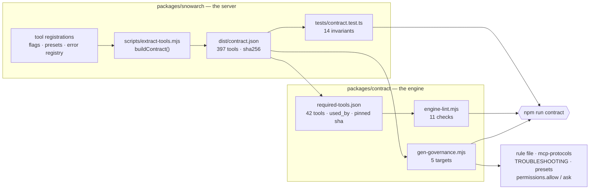

# ARCHITECTURE.md — target repository layout

> **Stub.** ARC-01-S01 writes this file so that reviewers of ARC-01-S02…S12 have the target in front of
> them while files are being moved into it. **ARC-01-S12 replaces it** with the full architecture
> document. The tree below is `docs/plans/01-TARGET-ARCHITECTURE.md` §3 **verbatim** — that document
> remains the source of truth; this is a convenience copy, and if the two ever disagree, `01` wins.

## The target tree

```
ai-servicenow-architect/                      farstic/ai-servicenow-architect · one git tag per release
├── CLAUDE.md                                 ≤200 lines: identity, routing protocol (Phase 1/2), §1.1 summary, the `Status` trigger (→ `/snowarch status`); imports nothing large
├── README.md                                 the ONE install page (2 commands, 2 dialogs, what you will see)
├── LICENSE · NOTICE                          single licence (D-02); Apache-2.0 attribution for ServiceNow/ServiceNowDocs
├── engine.config.json                        product name, server key, floors (claude/node/git), docs family+pin, roster expectations
├── package.json · package-lock.json          ROOT = version of record; workspaces ["packages/*", "tools/snowarch"]; scripts {bootstrap, doctor, test, lint, release}
├── bootstrap.sh · bootstrap.ps1 · bootstrap.cmd   launchers (bash 3.2 / PowerShell 5.1 / cmd → PowerShell with -ExecutionPolicy Bypass)
├── snowarch · snowarch.cmd                   post-install command launcher → node tools/snowarch/bin/snowarch.mjs "$@"
├── .mcp.json                                 COMMITTED, secret-free project-scope registration of server key "servicenow" (§5)
├── .gitmodules                               vendor/ServiceNowDocs · branch = australia · shallow = true
├── .gitignore                                .local/ clients/ node_modules/ .env .claude/settings.local.json .DS_Store Thumbs.db
├── .gitattributes                            *.mjs *.md *.json *.sh text eol=lf; *.ps1 *.cmd eol=crlf
├── .claude/
│   ├── settings.json                         COMMITTED team settings: env.MCP_TIMEOUT, SessionStart hook (exec form, node), generated permission allow-list (reads) and ask-list (mutating tools — the mechanical half of §2.1 under auto mode)
│   ├── rules/
│   │   └── 00-mode-and-mcp-gate.md           GENERATED from the contract: the §2.1 write gate (prefix, "write approved"), §2.2 capture sequence, Mode semantics (~40 lines, always loaded)
│   ├── skills/
│   │   ├── <27 specialist skills>/SKILL.md + EXAMPLES.md   single canonical copy; descriptions ≤ 500 chars (lint); triggers in body
│   │   ├── now-assist-genai/                 reference companion (28th SKILL.md)
│   │   └── snowarch/SKILL.md                 /snowarch status · setup-instance · doctor (R-2): quotes the doctor Mode line; guided front-end of the wizard (§6); roster from directory listing
│   └── agents/<9>.md                         single canonical copy; model: inherit; skills: [<persona>] preload; explicit tools lists (no MCP)
├── governance/
│   ├── governance/governance-rules.md                   §1.1, §2 (references the generated rule), §4 — read on demand as today
│   ├── governance/taxonomy.md · governance/prompt-patterns.md      read on demand as today
│   └── mcp-protocols.md                      GENERATED long form of §2.1/§2.2 with current tool names (the rule file is its digest)
├── packages/
│   ├── snowarch/                             the server + CLI package (from farstic/snow-mcp, server-only scope — ARC-04)
│   │   ├── package.json                      name @farstic/snowarch; version == root (lint); engines node>=20; runtime deps only
│   │   ├── src/                              server.ts, tools/, servicenow/, utils/, resources/, cli/ (instance · doctor · contract · start)
│   │   ├── dist/                             COMMITTED prebuilt output incl. tools-manifest.json and contract.json (CI rebuilds and diffs)
│   │   └── tests/                            vitest (server-scoped root), incl. contract.test.ts
│   └── contract/
│       ├── required-tools.json               41 tools = 35 engine-cited + snow_us_update_set_preview (§2.2 protocol) + 5 core, each {name, gate, mutates, used_by[]}; contractSha256 pin
│       ├── retired-names.json                copy of tool-rename-map.json keys — forbidden as bare words
│       └── lint/engine-lint.mjs              engine-side contract lint (§11)
├── tools/snowarch/                           ZERO-DEPENDENCY Node ESM CLI (node:fs, child_process, readline, https, crypto)
│   ├── bin/snowarch.mjs                      bootstrap | doctor | instance … | docs … | mode … | upgrade | version
│   ├── lib/steps/B00…B09.mjs                 one file per bootstrap step (idempotent; declares an inputs hash)
│   ├── lib/steps/index.mjs                   the registry and the runner: order, cache decision, interrupt
│   ├── lib/plan.mjs                          the one amendable plan screen (principle 10)
│   ├── lib/state.mjs                         .local/bootstrap-state.json read/write/resume
│   ├── lib/doctor/                           engine-side checks E-xx; merges server checks SV-xx from packages/snowarch
│   └── hooks/session-start.mjs               prints the Mode banner (<300 ms; reads .local/doctor-last.json)
├── vendor/
│   ├── ServiceNowDocs/                       submodule, checked out depth-1 + cone-sparse (§10)
│   └── docs-areas.txt                        GENERATED list of cited top-level areas (one per line; consumed by launchers and Node)
├── templates/                                ADR, RTM, RAID, NFR, HLD, Gherkin (merged)
├── docs/
│   ├── INSTALL.md (= README body) · MODES-AND-PRESETS.md · TROUBLESHOOTING.md (GENERATED) · PLATFORM-NOTES.md · ARCHITECTURE.md · CONTRIBUTING.md · CHANGELOG.md (GENERATED) · MIGRATION.md (ARC-10) · USER-GUIDE.md · CLIENT-ONBOARDING.md (ARC-02)
├── scripts/                                  MAINTAINER only: build-dist.mjs, release.mjs, gen-docs-areas.mjs, docs-bump.mjs, md-to-docx.py/.ps1, render-drawio.sh / render-diagrams.ps1, render-pdf.sh / render-pdf-pages.ps1
├── tests/                                    engine tests: roster lint, description-length lint, version-consistency, VALIDATION-TESTS.md (manual T-01…T-18)
├── .github/workflows/ci.yml · docs-bump.yml · release.yml
└── .local/                                   GITIGNORED per-checkout state: instances.json (0600) · config.json · bootstrap-state.json · doctor-last.json · audit.jsonl · logs/
```

Not in the repository: any client engagement content (`clients/` stays gitignored and per checkout), `.claude/settings.local.json`, `.env`, the author's personal hook tooling (see the retired-name glossary below), the Electron desktop app, the other-client guides.

## Directory → owner ARC

Which programme increment first creates or populates each path. **Nothing is created empty**: git tracks
no empty directories, so a path appears in the repository only when its owner puts a file in it.

| Path | Owner | Notes |
|---|---|---|
| `LICENSE` · `NOTICE` · `docs/RELICENSING.md` | **ARC-01** (S01) | D-02; the relicensing sentence is in this commit's message |
| `docs/decisions/` | **ARC-01** (S01) | ADR-0001…0008, imported verbatim from the spike workspace |
| `docs/spikes/` | **ARC-01** (S01) | ARC-00's spike records, stub server, recipes, hooks, licence working files |
| `engine.config.json` | **ARC-01** (S01) | from `spikes/engine.config.seed.json`; schema validated by ARC-01-S04 |
| `docs/ARCHITECTURE.md` | **ARC-01** (S01 stub → **S12** full) | this file |
| `CLAUDE.md` · `governance/` · `.claude/skills/` · `.claude/agents/` · `templates/` · `scripts/` | **ARC-02** | engine consolidation; imported with history |
| `README.md` · `.gitignore` · `.gitattributes` | **ARC-01** (S02 import, S07 replace) | the engine's own files arrive first, then are replaced |
| `vendor/ServiceNowDocs` · `vendor/docs-areas.txt` · `.gitmodules` | **ARC-03** | docs corpus; recipe C **plus the root-file repair step** (ADR-0008) |
| `packages/snowarch/` | **ARC-04** | the MCP server and its CLI |
| `packages/contract/` | **ARC-05** | required-tools, retired-names, engine-lint |
| `.claude/settings.json` · `.claude/rules/` | **ARC-05** | generated permission rules and the §2.1/§2.2 rule file |
| `bootstrap.sh` · `bootstrap.ps1` · `bootstrap.cmd` · `snowarch` · `snowarch.cmd` · `.mcp.json` · `tools/snowarch/` | **ARC-06** | bootstrap and registration |
| `tools/snowarch/lib/steps/` (instance wizard) | **ARC-07** | credentials; `.local/instances.json` at 0600 (D-04) |
| `tools/snowarch/lib/doctor/` · `tools/snowarch/hooks/` | **ARC-08** | doctor and self-heal |
| `.github/workflows/` · `package.json` · `package-lock.json` | **ARC-01** (S11) → **ARC-09** | CI first, then release and upgrade |
| `docs/MIGRATION.md` | **ARC-10** | migration and cutover |
| `.local/` · `clients/` | — | **gitignored, per checkout**; never committed |

## Registration files

Two files travel with the clone and one never does.

**`.mcp.json`** registers the server: `stdio`, `node`, and
`${CLAUDE_PROJECT_DIR:-.}/packages/snowarch/dist/server.js` — forward slashes, because Node accepts
them on Windows and a backslash in JSON is an escape waiting to be got wrong. Every `${…}` carries a
`:-` default, since an unset variable without one is passed through as the literal text. The `env`
block holds `SNOW_STORE` and `SNOW_LOG_LEVEL` and nothing else: ARC-00 S-20 confirmed the spawned
server **inherits** the launching shell's environment, so proxy and CA variables need no repeating
(the story's other branch, listing them, belongs to the "forward" verdict we did not get).

**`.claude/settings.json`** holds `permissions` — **generated** from the contract by
`gen-governance.mjs`, never hand-written — and `env.MCP_TIMEOUT: "120000"`, which is ARC-00 S-06's
measurement: about 160× the worst handshake observed over 27 runs on nine CI cells. It is
**hook-free** by ARC-00 S-05: a `SessionStart` hook in the committed file would run before Node is
known to exist, so the bootstrap writes it into the gitignored `settings.local.json` once Node ≥ 20
is confirmed.

**`~/.claude.json` is never written by anything here.** That file is why P-01 exists — the previous
engine was registered by hand-editing it and ended up holding a plaintext password keyed on an
absolute path. Measured on this checkout: starting a session changes exactly one top-level key,
`cachedGrowthBookFeaturesAt`, the CLI's own feature-flag cache.

## Docs corpus: how the pin, the areas file and the gate relate

Three artefacts, and the design is which of them may disagree with which.

| Artefact | Written by | Read by |
|---|---|---|
| **the commit** — the gitlink and `docs.pin`, the same SHA | the seed commit, then only `docs sync --upstream` — never by hand | the recipe, the launchers, the doctor's E-checks, `docs-bump.yml`, ARC-09's release tag |
| **`vendor/docs-areas.txt`** — which areas materialise | `gen-docs-areas.mjs`, from the areas cited; CI fails when stale | the cone, the completeness check, the recipe |
| **the citation gate** — every `markdown/…` path cited | nobody: a property of the skills | `docs verify`, `docs status`, the bump workflow, CI |

**The invariants**, in the order they are checked:

- `docs.pin` **==** the gitlink. They diverge only while a bump is staged; `docs status` prints
  `(staged)` for exactly that window instead of MISMATCH.
- the cone **==** the areas file **plus `legal/`**. `legal/` is neither an area nor a root file, so
  cone mode leaves it out — the recipe names it and the completeness check enforces it, because
  NOTICE claims it is in every checkout and a claim nothing checks is a claim that decays.
- **dead citations == 0.** A citation upstream removed is the corpus saying a skill is now wrong about
  the platform. Never fixed by deleting the citation.
- **an absent corpus is a FAIL, never a skip** — the script this replaced exited 0 with the corpus
  missing, so a fresh clone passed with every citation unverified.

### The commands

`docs sync` reconciles locally and is safe for anyone: clone if absent, mode, pin, gitlink, the
ADR-0008 root repair. A clean second run issues no git write, prints `up to date`, and ends — as
every run does — with the attribution line. **Populated is checked separately from at-the-pin**: a
`--no-checkout` clone whose pin is the branch tip has correct HEAD and an empty tree. `docs status` answers "is this corpus right" in four
lines (pin/gitlink/HEAD · family/branch · shape and areas · citations), each `ok` or `MISMATCH` with
its remedy, computed by `docsStatus()` — which ARC-08's doctor wraps rather than re-derives.

`docs sync --upstream` is the maintainer refresh: refuse a dirty tree, fetch, **verify at the old
pin**, move, verify again, write the pin, stage — never commit. The baseline runs first because
"newly dead" is a difference between two states, and the first stops existing when the corpus moves.

`docs family <name>` switches release family: the dry run **is** the proposal and `--yes` applies
exactly what it printed. A prose line is edited only when the matched phrase is its *only* family
mention — anything else is REVIEW, because half a sentence about each family is worse than an
untouched line. The pin moves first, while the tree is still clean, so the dirty-tree refusal guards
the whole operation instead of tripping on the command's own edits.

`docs-bump.yml` runs the refresh weekly and opens **one** pull request — branch named for the
target SHA, so a re-run updates rather than duplicates and a newer tip supersedes the older. **It
never merges.** A dry run exits 0 with a `::warning::`; the red build belongs on the pull request. It
builds from the PR's **base**, not the dispatch ref, and needs two repository settings it cannot
assert: "Allow GitHub Actions to create and approve pull requests", and "Approve and run" on a
bot-authored PR's first CI run.

`docs-real.yml` runs the recipe against the **real** corpus on all three OSes — weekly, on demand,
and when the code that decides the checkout changes; not a required context (network, a minute per
OS). Its Windows cell strips Git Bash and clears `core.longpaths` first so it measures the recipe
rather than the image, and a second cell keeps Git Bash: the two passing identically is the proof
nothing here depends on bash.

**E-12** is `E12_ABSENT(mode)` in `status.mjs`, printed by `docs status` and imported by the doctor,
never retyped — **FAIL**, never WARN or SKIP, because an absent corpus leaves every citation in every
skill unverified.

### The git-only corpus recipe

ARC-06's launchers run this when Node is absent. Not a paraphrase of `sync.mjs`:
`tests/docs-recipe.test.mjs` asserts the block is byte-identical to `--print-recipe` on a tree with
no checkout, down to one character. Edit the module, regenerate, paste — never the reverse. The area
list is one long line on purpose; wrapped or reordered is a different checkout.

<!-- DOCS-RECIPE:BEGIN (generated by scripts/gen-docs-recipe.mjs — do not edit) -->

```sh
git clone --filter=blob:none --no-checkout --depth 1 --sparse --branch australia https://github.com/ServiceNow/ServiceNowDocs.git vendor/ServiceNowDocs
git -C vendor/ServiceNowDocs sparse-checkout set --cone markdown/api-reference markdown/application-development markdown/build-workflows markdown/core-business-suite markdown/customer-service-management markdown/employee-service-management markdown/governance-risk-compliance markdown/integrate-applications markdown/intelligent-experiences markdown/it-asset-management markdown/it-business-management markdown/it-operations-management markdown/it-service-management markdown/now-intelligence markdown/now-platform markdown/platform-administration markdown/platform-security markdown/platform-user-interface markdown/servicenow-platform legal
git -C vendor/ServiceNowDocs fetch --depth 1 origin 11b39be17307dd4b21df15a54e8011ae68f64dba
git -C vendor/ServiceNowDocs checkout --detach 11b39be17307dd4b21df15a54e8011ae68f64dba
git submodule absorbgitdirs vendor/ServiceNowDocs
git submodule init -- vendor/ServiceNowDocs
echo "docs: ServiceNow product documentation © 2026 ServiceNow, Apache-2.0 — vendor/ServiceNowDocs/LICENSE"
```

<!-- DOCS-RECIPE:END -->

**On Windows the sequence gains one line** — a single block cannot be byte-identical on both
platforms, so this one is the POSIX form:

```powershell
git -C vendor/ServiceNowDocs config core.longpaths true
```

The launcher then checks each line of `vendor/docs-areas.txt` exists under
`vendor/ServiceNowDocs/markdown/` and prints `citations: not verified until Node 20+ is installed`.
S-07's criterion 2 was refuted — the corpus fits in 260 characters under a *short* prefix — but a CI
temp directory ate that margin at ARC-03-S05, so `core.longpaths` stays.


## Exit codes — every `docs` sub-command shares one table

| Code | Meaning |
|---|---|
| **0** | ok |
| **1** | incomplete checkout · the pin moved **and** citations broke · dead citations · a status mismatch |
| **2** | a plan was printed and not applied (`family` without `--yes`) |
| **3** | the corpus is missing |
| **4** | the working tree is not clean — nothing was touched |
| **5** | git failed; the message says how (DNS · proxy · TLS · unfetchable pin · disk) |
| **6** | the upstream does not have what was asked for — renamed branch, unreachable SHA |

4, 5 and 6 stay distinct: "you have unsaved work", "the transport failed" and "it is not there" have
three different remedies, and a caller that collapsed them would send someone to the wrong one.

## Bootstrap steps and state file

`./snowarch bootstrap` shows one amendable plan, then runs ten numbered steps uninterrupted,
recording each one so a failure, a Ctrl-C or an upgrade never means starting over.

### The steps

Each step module in `tools/snowarch/lib/steps/` — `B00.mjs` through `B09.mjs` — exports
`{ id, title, needsNode, runsWhen, inputs, run }`
and, when it can be skipped, a `skipReason`. Every module is importable and its `run(ctx)` callable
on its own, so ARC-08's `--fix` can invoke one without the runner.

| Step | Title | Needs Node | Runs when | Inputs hashed |
|---|---|---|---|---|
| B00 | preflight | no | always (never cached) | — |
| B01 | workspace | no | always | `.mcp.json`, `.claude/settings.json`, mode |
| B02 | docs | no (checkout) / yes (citations) | docs mode ≠ skip | the areas file, the corpus gitlink from the index, docs mode |
| B03 | mode | no | always | the accepted mode |
| B04 | deps | yes | mode = live | `package-lock.json`, Node **major** |
| B05 | contract | yes | Node present | `dist/contract.json`, `required-tools.json` |
| B06 | instance | yes | mode = live | store schema version, store presence, whether `--instance-file` was given |
| B07 | toggles | no | always | mode, Node present, the hook branch, registration kind |
| B08 | verify | yes | mode = live | contract sha, store mtime |
| B09 | summary | no | always (never cached) | — |

B00 and B09 are never cached, and each says so on the step rather than in the runner: B00 decides
whether the machine can run the others, and B09 describes the run that just happened.

### The hash, and what it is allowed to read

Every input is TAGGED — `file:<path>` or `text:<value>` — and `sha256` runs over the tag, the key
and the content of each, NUL-separated, in the order the step declared them. A missing file hashes
as the literal `<absent>`, so "not installed yet" and "installed nothing" are different digests. An
untagged entry is an error rather than a guess: read as a path, `design-only` would be found missing
and hashed as `<absent>`, which would give live and design-only the same digest.

Two inputs are deliberately narrow. B02 hashes the **gitlink**, not the corpus — reading 35,000
files to decide whether to skip a step would cost more than the step, and an unrelated `touch` would
invalidate it. B06 hashes only the store's schema version and whether it exists: `.local/instances.json`
holds credentials, and a hash that read further would put one a careless line away from the log.

### B00 preflight — the seven checks

Every prerequisite is checked before anything is installed, and **every check runs even after one
has failed**: an operator missing git *and* behind a TLS-intercepting proxy learns both in one pass
rather than discovering the second after fixing the first. Any FAIL ends the run with
`FAIL B00: <n> prerequisite(s) missing` and **exit 3** — before the plan screen, and before
`.local/` exists.

| # | Check | Fails when | Remedy comes from |
|---|---|---|---|
| 1 | root | `cwd` is not the checkout, or git reports a different toplevel (both compared through `realpath`) | `remedies.json` → the platform's own `cd` |
| 2 | git | absent, or below `floors.git` | `xcode-select` · `winget` · the distribution package |
| 3 | Claude Code | absent, or below `floors.claudeCode`. Not logged in is a **WARN**, never a FAIL — signing in is Claude Code's own first-run flow | the install page |
| 4 | disk | less than 1 GiB free (1.5 GiB for the full corpus). Unmeasurable is a WARN, not a FAIL | `free up <n> MB on <mount>` |
| 5 | network | `HEAD https://github.com/` fails — through `HTTPS_PROXY` by CONNECT tunnel, honouring `NO_PROXY` | the shared network vocabulary (below) |
| 6 | Node | absent or below `floors.node` — a `note:` in design-only, a FAIL only for live | `brew` · `winget` · nvm |
| 7 | platform | never; 32-bit is a WARN | — |

The floors are read from `engine.config.json` and **never typed into the code**; a test strips
comments from every module under `tools/snowarch/lib/` and asserts none of them spells a configured
floor, so lowering a floor in the config genuinely lowers the threshold.

Remedies live in `tools/snowarch/lib/remedies.json` as `{ checkId: { darwin, win32, linux, default } }`
because the Node-free launchers (S10/S11) print the same sentences with no Node to read them, and
the doctor quotes the same table. One wording, three programs.

**One network vocabulary.** `lib/net-sentences.mjs` owns the DNS, proxy, TLS and disk sentences;
`classifyGitFailure` (git's stderr) and `probe-net.mjs` (Node's HTTPS) both import them, so an
operator behind a corporate proxy does not learn two vocabularies for one problem depending on which
half of the tool noticed first. The single parameterised difference is the CA sentence: it names the
failing tool's knob first (`GIT_SSL_CAINFO` or `NODE_EXTRA_CA_CERTS`) and the other second, because
a corporate bundle is always needed by both. A proxy URL is masked to `***@host:port` where the
sentence is built, not on the way to the terminal.

### B01 workspace and B07 toggles — what the bootstrap writes

Four files, all of them gitignored, and **nothing outside the checkout**: `~/.claude.json` and
`~/.claude/settings.json` are never touched.

| File | Written by | What goes in it |
|---|---|---|
| `.local/` (+ `logs/`) | B01 | 0700 on POSIX — an existing directory is chmodded, so a checkout bootstrapped before this rule stays private too. Windows records `fileModes: acl-inherited`. |
| `.local/bootstrap-state.json` | the runner | S03's schema v1 |
| `.claude/settings.local.json` | B07 | **two array members and one hook entry, merged** |
| `.local/config.json` | B07 | `{ version, mode, defaultInstance, registration, updatedAt }` |

**`settings.local.json` is never overwritten.** It belongs to the operator — their permission
grants, their overrides, whatever Claude Code has written on their behalf. B07 reads it, applies its
two changes and writes the same object back: other keys untouched, other array members preserved,
existing key order kept, new keys appended. Design-only puts the server in `disabledMcpjsonServers`
(which wins over the enable list in Claude Code); live puts it in `enabledMcpjsonServers` and
removes the disable entry. A registration that is not `project` rejects the project entry whatever
the mode says. **Invalid JSON is the only failure**, and the bytes are left exactly as found — a
stray comma must not cost someone their settings. The file must be gitignored before anything is
written, or Claude Code will not apply its approvals.

**The SessionStart hook is S-05 variant B**: the committed `settings.json` is hook-free, and B07
writes the hook into the *local* file only when Node ≥ 20 is present, removing it otherwise. A hook
that runs `node` on a machine without Node is an error on every session start. There is no
`disableAllHooks` branch — it would have silenced the operator's personal and plugin hooks too.

**B01 verifies the registration files two ways**, because they catch different mistakes:
`git diff --quiet HEAD` sees an uncommitted edit, and ARC-06-S01's rules — re-evaluated at run time
from `lib/registration.mjs`, which the S01 test imports too — see one that was committed. A failure
names the file and the `git checkout --` remedy, and `.local/` is still created so the next run
starts from somewhere.

**`config.json`'s `defaultInstance` is a mirror, never a second source.** The store is
authoritative; ARC-07's `set-default` re-mirrors it. It is read through `readDefaultLabel`, a
zod-free reader that returns exactly one key — so no URL, username or credential can reach a file
that, unlike the store, is not 0600.

**The cloud-sync warning names the provider.** `isUnderCloudSyncFolder` in the committed server
build answers *whether*; `lib/cloud-sync.mjs` adds *which*, and a test asserts the two never
disagree. It is a WARN and not a FAIL: 0600 is a local permission and the sync client runs as the
same user, but where someone keeps their code is their decision.

### B02 docs — one step over ARC-03's recipe

B02 is glue, deliberately: `syncCorpus` decides what git does, `verifyCitations` decides what the
citations mean, `docsStatus` measures. The step maps their results onto one step line and records
numbers only. `--docs sparse|full` pass the plan's mode through; `--docs skip` never reaches the
step at all (`runsWhen` is false), so no code path can make a network call the operator declined.

The one judgement it makes is which failures stop an installation. A broken checkout does — nothing
downstream can be grounded. A **dead citation does not**: the corpus is present, the fix belongs to
a maintainer, and refusing to install over it would punish the wrong person, so it is a WARN. The
docs family's exit codes map to remedies: `1` incomplete → `run ./snowarch docs sync`; `4` dirty and
`5`/`6` git and upstream keep ARC-03's own sentences unaltered, because a second phrasing gives one
situation two descriptions depending on which command hit it.

### One recipe, four readers

`tools/snowarch/lib/docs/recipe-block.mjs` renders the git-only recipe, and **three files are
generated from it**: the published block in this document, and `tools/snowarch/launcher/docs-recipe.sh`
and `.ps1`, which the Node-free launchers source. `docs sync --print-recipe` is the fourth reader of
the same function. Nobody types the commands twice, and `tests/docs-recipe.test.mjs` diffs every
target against the renderer with a unified diff that names the file and the line.

Each target declares the platform it is written FOR — the PowerShell launcher is a Windows file
whether it was generated on a Mac or not — and the generator writes with the file's own line
endings, because `.gitattributes` stores `*.ps1` as `eol=crlf` and a generator that spliced LF into
it would report STALE for ever on a clean checkout. A pin bump regenerates all three, so its staged
list is five paths when the pin moves and two when it does not.

### B03–B06 — mode, dependencies, contract, instance

**B03** writes down the answer the plan screen already collected — into the state and
`.local/config.json`, through B07's writer — and asks nothing. Because the mode is a hashed input of
B06, B07 and B08, changing it re-runs exactly those three; that is a property of the inputs, not a
rule somewhere.

**B04** runs `npm ci --omit=dev --ignore-scripts --no-audit --no-fund` at the root (the S-15
verdict), as a script under the running Node rather than through the `npm` shim — `child_process`
refuses a `.cmd` without a shell, and a shell is what the bootstrap does not use. `--ignore-scripts`
is the difference between installing packages and running whatever their authors put in
`postinstall`, on a machine that has just cloned a repository. The post-check asks whether every
dependency the server *declares* resolves *from `dist/server.js`* — hoisting-safe, no names typed —
and treats `ERR_PACKAGE_PATH_NOT_EXPORTED` as present, because only an installed package can refuse
a subpath. npm's failures map to remedies that fit them: registry DNS, TLS interception, lockfile
integrity, `EACCES`, disk; anything else shows the last twenty log lines and the log's path.

**B05** asks three questions about the checkout's own consistency — the contract's sha against the
engine's pin, every pinned tool present in the contract, and the server's suggested registration key
against `engine.config.json`. It runs in **both** modes: design-only grounds its rules in the same
contract. ARC-05's CI proves this on every commit; B05 proves it on the machine about to run.

#### The B06 slot

Two ways in, and they are different jobs.

```js
// Interactive — SPAWN, never import: the wizard reads raw-mode keystrokes and masks a password,
// and a library called in-process cannot own a TTY the bootstrap is also using.
spawnSync(process.execPath,
  [root + '/packages/snowarch/dist/cli/index.js', 'instance', 'add', '--from-bootstrap'],
  { stdio: 'inherit', cwd: root })
// exit 0 → the wizard printed its own secret-free summary; B06 then reads the label back through
//          the store module, and learns nothing else — never a URL, a username or a credential.

// Non-interactive — ARC-07-S05's addInstance(); until it lands, the store module directly:
addInstance({ label, url, environment, auth, preset | flags, makeDefault, global: false, yes: true },
            io) → { saved, entry /* masked */, lastProbe, exitCode }
```

`dist/cli/index.js` exists only after B04, so both are reached lazily; the CLI is probed for
`instance add` **before** it is spawned, so a build that does not have it yet is named rather than
spawned into. No terminal and no `--instance-file` is a named failure, not a hang.

**`--instance-file`** is the operator's path (README, "Operators and CI"). The file is a store
document, checked for mode 0600 *before it is read* — a file the group can read has already leaked —
and refused if git could commit it. **The D-05 proposals are applied before validation**, and that
order is forced rather than chosen: the store schema is strict and requires `environment` and
`preset`, so a file that omits them — exactly the file D-05 says to accept — cannot be parsed until
they are filled in. The presets are chosen by **shape**, not by name: "most permissive" and "most
restrictive" are roles the contract expresses as how many flags each raises. Passwords are
registered with the redactor the moment they are parsed, before any line is logged, and the
credential is authenticated exactly **once**.

### B08 verify — the server, spawned the way Claude Code will spawn it

B08 is the first moment the product is actually exercised, and it **spawns** rather than imports:
the failures worth catching are the child's — a cold start slower than `MCP_TIMEOUT`, a `dist/`
that does not match the pinned contract, an `SNOW_STORE` in the operator's shell pointing somewhere
else — and none of them reproduce in-process. `lib/mcp-handshake.mjs` speaks newline-delimited
JSON-RPC over the child's stdio, stdlib only: `initialize` → `notifications/initialized` →
`tools/list` with cursor pagination → (live) one `tools/call`, then stdin closed and ≤ 5 s to exit.
One retry on an EPIPE at spawn, because npm has just written `node_modules`; every other failure is
a failure, and every exit goes through one settle under one deadline.

Three comparisons, catching opposite mistakes: a tool the server advertises that the contract does
not know means `dist/` is ahead of the pin; a **pinned** tool the server does not advertise means
the governance texts cite something nobody can call, so that one names its `used_by` — those are
the files that will break. Unconfigured is a different expectation rather than a relaxed one: S-17
says exactly the core set, and the names come from the build that decides them.

#### `.local/doctor-last.json` v1 — what the banner reads

The SessionStart banner must print a verdict in under 300 ms on a machine that may have no Node, so
it cannot run checks; it reads the last ones. That makes this file a **contract**: ARC-08-S01's
schema may add keys, never rename `version`, `at`, `writer`, `mode`, `checks[]{id,status,detail,remedy?}`
or `summary`. `writer` says who produced it — `bootstrap` here, `doctor` in ARC-08 — so a banner
reading a cache from a run that skipped half the checks can tell. It is 0600 and atomic, with the
mode applied to the temp file **before** the rename so the finished file is never briefly
world-readable, and it goes through the same write-time secret guard as the bootstrap state: a URL,
an address or a registered secret fails the write rather than reaching a file things read casually.

### B09 summary — one verdict, one Mode line, and what to type next

The last five lines are the only part of the installation most people read twice, and two of them
are **promises**. The `Mode:` line is quoted verbatim by four programs — the bootstrap's summary,
the SessionStart banner, `/snowarch status` and `snowarch mode` — so it has **one definition**, in
`tools/snowarch/lib/text.mjs`. The doctor additionally prints a *detailed* variant that appends its
own findings; that is a longer line for a longer report, not a second Mode line.

The dialog count is the other promise: one sentence per dialog, never a hedge, because "you may see
one or two" makes a reader distrust every other line in the summary. `EXPECTED_DIALOGS` is 1, from
the owner's 2.1.258 sitting recorded in `docs/plans/03-RISKS-AND-UNKNOWNS.md` §F, and a test reads
that row rather than another copy of the number.

The command spellings follow the **shell**, not only the platform: Git Bash on Windows runs
`./bootstrap.sh` perfectly well, so `.\bootstrap.cmd` is printed only when `SHELL` and `MSYSTEM`
are both unset. `text.json` is generated from the same module, and the Node-free launchers read it
— one definition, three programs, the same shape as `remedies.json`.

B09 **returns** its block rather than printing it: the runner prints a step's line after `run()`
returns, so a block written from inside would be followed by `[B09/09] summary … ok` and the closing
five lines would not be the last five. `--json`'s `next` carries that same string, so the two cannot
drift. Design-only runs also write the banner's cache here, since they never reach B08 — and a live
run's cache is left alone, because a handshake's findings should not be replaced by a summary's.

### `bootstrap.sh` — the launcher

Two jobs. When Node ≥ 20 is present it **`exec`s** the Node CLI, forwarding every flag, with
`CLAUDE_PROJECT_DIR` exported — the launcher's spawn is our spawn, so the session variable is set
rather than inherited. When Node is absent it finishes **design-only itself**: B00 (git, Claude
Code, disk, and a network probe through `git ls-remote`), a two-line plan, B01, B02 through the
generated recipe, a restricted B07, and B09's block.

bash 3.2, because macOS ships it and always will: no associative arrays, no `mapfile`, no
`${var,,}`, no `[[ =~ ]]` captures, and none of `curl`/`jq`/`python`/`timeout`. A test greps for
every one of those and proves the grep is not vacuous.

**Nothing is written twice.** The recipe is *sourced* from `tools/snowarch/launcher/docs-recipe.sh`;
the sentences — remedies, the network vocabulary, the closing block — are generated into a marked
region from `remedies.json`, `net-sentences.mjs` and `text.json`. `tests/launcher-parity.test.mjs`
compares every one against its source, because this is the file that runs on machines with no Node
to check it, and a drifted copy there would go unnoticed for a release.

**B07 without Node writes the disable toggle and nothing else** — no hook, because nothing could run
it — and it **never merges**: an existing `settings.local.json` that already carries the toggle is
`ok (already set)`, and any other one is a hand-edit FAIL with the exact key to add. Merging JSON in
bash is how someone's settings get destroyed.

The state and the cache are written by heredoc in S03's and S08's schemas, `writer: "bash"`, and the
Node readers accept them — asserted against a fixture captured from a real bash-3.2 run.

### The resume rule

For each step in order: `runsWhen` false → `skipped (<reason>)`; `--from BNN` and the step is at or
after `BNN` → run; recorded `ok` and `sha256(inputs)` unchanged → `ok (cached)`; otherwise run. A
`fail` stops the run after the state is written; a `warn` continues. An interrupt outranks whatever
the step goes on to return, because the record of why a run stopped is what the next one reads.

`--reset` removes `.local/bootstrap-state.json` and `.local/doctor-last.json` and nothing else —
`.local/instances.json` (the credential store) and `.local/config.json` are never touched, and the
command says so.

### `.local/bootstrap-state.json` v1

Atomic (temp file + `rename`), `0600` on POSIX, and on Windows it records `"fileModes":
"acl-inherited"` rather than implying a mode nobody applied.

```json
{ "version": 1, "product": "snowarch", "engineVersion": "2.0.0",
  "mode": "design-only", "docs": { "mode": "sparse", "pin": "ba513f2c…" },
  "node": { "present": true, "version": "22.11.0" },
  "writer": "node", "platform": "darwin",
  "registration": "project", "registrationReason": "default",
  "hooksDisabledByBootstrap": false,
  "startedAt": "…", "updatedAt": "…",
  "steps": { "B00": { "status": "ok", "inputsHash": null, "finishedAt": "…", "durationMs": 812 },
             "B04": { "status": "failed", "inputsHash": "sha256:…", "reason": "interrupted" } } }
```

`mode` is `null` until the plan is accepted. `writer` is `node`, `bash` or `powershell` — the
Node-free launchers write the same schema. `docs.mode` sits exactly where `docsStatus()` reads it,
and `mode` where the `/snowarch status` skill reads it when the doctor cannot run; both are why the
shape is versioned, and why a `version` this build does not know is refused rather than migrated on
the fly.

**Nothing sensitive may be stored, and that is enforced at write time**, not by a grep afterwards:
`saveState` walks the whole object and refuses any key that names a secret — the same rule the
redactor uses, imported rather than restated — and any value that looks like a URL or an address, or
that the redactor would rewrite. A step three stories from now that puts an instance URL in its
`data` blob fails on the write, not in review.

### Exit codes — the CLI family

| Code | Meaning |
|---|---|
| **0** | ok |
| **1** | a step or command failed; the cause and a remedy were printed |
| **2** | usage error |
| **3** | a prerequisite is missing |
| **130** | interrupted (Ctrl-C); the state was flushed first |

This is a **different table** from the `docs` one above, and the overlap is worth naming: `3` means
"the corpus is missing" there and "a prerequisite is missing" here. Both are "the thing you need is
not present", which is why the two coexist — but a caller keying on a number must know which family
it is reading. `lib/exit.mjs` holds these five and deliberately does not re-export the docs codes.

## Roster

Generated from the directory listing by `scripts/gen-roster.mjs`, and checked by `npm run lint`.
Five documents used to disagree about these numbers, and every one of them was true when it was
written (P-12) — so nothing here is typed. Edit a skill or an agent and re-run the generator;
never edit between the markers.

<!-- ROSTER:BEGIN (generated by scripts/gen-roster.mjs — do not edit) -->

**27 specialist personas · 28 skills (incl. now-assist-genai reference companion) · 9 sub-agents**

### Skills

| Skill | Fires as | Sub-agent | Version |
|---|---|---|---|
| `app-engine-specialist` | on demand | — | 1.1.0 |
| `atf-author` | post-build consult | yes | 1.1.0 |
| `cmdb-csdm-specialist` | gateway | — | 2.0.0 |
| `code-reviewer` | post-build consult | — | 1.0.0 |
| `csm-specialist` | gateway | — | 2.0.0 |
| `developer` | builder | yes | 1.0.0 |
| `devops-release-manager` | routing-time consult | — | 1.1.0 |
| `diagramming-specialist` | post-build consult | yes | 1.0.0 |
| `discovery-specialist` | on demand | — | 1.1.0 |
| `estimation-specialist` | on demand | — | 1.0.0 |
| `flow-designer-specialist` | builder | yes | 1.0.0 |
| `hld-lld-writer` | builder | yes | 1.0.0 |
| `hrsd-specialist` | gateway | — | 2.0.0 |
| `integration-specialist` | builder | yes | 1.0.0 |
| `itom-discovery-specialist` | gateway | — | 2.0.0 |
| `itsm-specialist` | gateway | — | 2.0.0 |
| `licensing-specialist` | routing-time consult | — | 1.0.0 |
| `migration-specialist` | on demand | — | 1.0.0 |
| `now-assist-genai` | reference | — | 1.0.0 |
| `now-assist-specialist` | builder | yes | 1.0.0 |
| `operational-documentation` | post-build consult | — | 1.0.0 |
| `performance-scale-specialist` | routing-time consult | — | 1.0.0 |
| `reporting-analytics-specialist` | on demand | — | 1.1.0 |
| `security-grc-specialist` | routing-time consult | — | 1.1.0 |
| `spm-specialist` | on demand | — | 1.1.0 |
| `story-writer` | builder | yes | 1.0.0 |
| `technical-designer` | builder | yes | 1.0.0 |
| `ui-ux-specialist` | on demand | — | 1.1.0 |

### Sub-agents

| Agent | Preloads | What it does |
|---|---|---|
| `atf-author` | `atf-author` | Generate a batch ATF (Automated Test Framework) test suite across an entire scoped ServiceNow app per a supplied app scope and spec. |
| `developer` | `developer` | Implement ServiceNow code (Script Includes, Business Rules, Client Scripts, UI Scripts, Scheduled Jobs, Background Scripts, Fix Scripts, custom Flow Action scripts) per a supplied spec. |
| `diagramming-specialist` | `diagramming-specialist` | Generate diagrams for a ServiceNow design from a supplied spec — one figure or a full pack of context/C4, ERD, sequence, swimlane, state, deployment, CSDM/CMDB map and roadmap/Gantt/RACI. |
| `flow-designer-specialist` | `flow-designer-specialist` | Design Flow Designer flows, subflows, custom Actions, and decision-table-driven branching per a supplied requirement. |
| `hld-lld-writer` | `hld-lld-writer` | Produce ServiceNow High-Level Design (HLD), Low-Level Design (LLD) or Process Design Document (PDD) artefacts. |
| `integration-specialist` | `integration-specialist` | Design integration architecture between ServiceNow and external systems — outbound REST/SOAP, inbound Scripted REST APIs, IntegrationHub spokes, MID Server topology, authentication, retry/DLQ patterns, payload security — per a supplied requirement. |
| `now-assist-specialist` | `now-assist-specialist`, `now-assist-genai` | Design ServiceNow Now Assist AI capabilities — AI Agents, agentic workflows, Now Assist skills, Virtual Agent topics, AI Search, AI Control Tower governance, prompt engineering, confidence routing, human-in-loop gates. |
| `story-writer` | `story-writer` | Convert requirements into sprint-ready Gherkin Feature files with ServiceNow conventions, OPEN QUESTIONS blocks, and proposed supporting stories. |
| `technical-designer` | `technical-designer` | Produce ServiceNow component design specifications — table model, field types, ACL matrix, business rule list with a rationale per item, client-side logic, flow outline, integration touchpoints, performance and security considerations, test strategy. |

### Utility skills

| Skill | Version |
|---|---|
| `snowarch` | 2.0.0 |

<!-- ROSTER:END -->

## Sub-agents

The sub-agents under `.claude/agents/` — counted in the roster block above — hold three invariants,
each enforced by a rule in `tests/agents-lint.test.mjs`:

- **Explicit `tools:`** (AG-03). Every agent lists its tools. An agent with no `tools:` key inherits
  *everything* the session has, MCP tools included — so the list is what structurally prevents a
  builder from touching a live instance (principle 8, DR-13).
- **`model: inherit`** (AG-04). No agent pins a model id. A pinned id rots as models change (P-10),
  and a dispatched agent should run on whatever the session runs on.
- **`skills:` preload** (AG-05). The persona arrives in the sub-agent's context through frontmatter,
  not by reading `SKILL.md` from disk. `EXAMPLES.md` is *not* preloaded, so agents still read it
  explicitly — verified in the ARC-02-S04 regression: the sub-agent read `SKILL.md` before the change
  and only `EXAMPLES.md` after it.

## Engine

**Audience split.** This document is for people changing the repository. The engine's own operating
rules — how the Chief Architect routes, what each specialist owns, what a builder must return — live in
`CLAUDE.md` and `governance/`, and are read by the model at runtime, not by a maintainer at design time.

### The contract: who generates, who pins, what fails



**The invariants that make it hold** are `packages/snowarch/tests/contract.test.ts` 5–8: the flag set is closed — the
contract, `permissions.ts` and every preset name the same six (5); no preset turns a flag on while
its prerequisite is off (6); a mutating name mutates (7); and gate and `mutates` imply each other in
both directions (8). Exceptions to 7 and 8 exist only as named classes in
`packages/snowarch/tests/contract-exceptions.json`, each with a reason, each required to be
load-bearing.

**What fails, and where.**

| Change | Fails | Says |
|---|---|---|
| a tool renamed, engine not told | server tests 1, 7, 10, 13 · lint `L01`, `L08`, `L11` | `pinned but not registered — a rename the engine has not been told about` |
| a tool re-gated | server test 2 · lint `L08`, `L11` | `expected gate=scripting, contract declares gate=write` |
| a seventh flag added to the source only | server test 5 | `permissions.ts references a flag the contract does not declare` |
| a generated file edited by hand | `gen:check` · lint `L06` | `differs from generator output (gen-governance)` |
| a retired name written into prose | lint `L03` | `retired name "…" → use …` |
| the contract changed, the pin not updated | server test 13 · lint `L11` | `contract sha changed — on the engine side run node packages/contract/pin.mjs` |
| a name typed into engine tooling | `tests/contract/no-literals.test.mjs` | `read it from the contract loader, or add it to the allow-list with a reason` |

All of it is one command — `npm run contract` — which runs in CI on nine cells, before a release
tag, and on your machine.

**A distribution-channel move is one line.** Spike S-14 asked what changing the tool prefix would
cost if the product moved to a plugin channel: `engine.config.json`'s `mcp.serverKey`, then
`npm run gen`. The prefix appears exactly once in the always-loaded rule file and once in the
long-form document, both rendered from that key, and `L02` fails on any other spelling — so the
answer is a configuration change and a regeneration, not a sweep.

**Engine tooling reads the contract through `packages/contract/lib/contract.mjs`.** Stdlib only,
zero dependencies, importable before `npm ci` — because ARC-06's bootstrap and ARC-08's doctor both
run in a checkout that has installed nothing yet. `loadContract({ root, verifyPin })` is the only
function that touches the filesystem and throws `ContractPinMismatch` carrying both shas; everything
else is a pure function of the object it returns: `flags`, `flagNames`, `presets`, `expandPreset`
(which enforces the dependency rule and names the offending pair), `tools`, `toolNames({ mutates })`,
`askList` (`mutates || sessionMutates` — one definition, shared by the permission block, the rule
file's count and the doctor), `unsupportedTools`, `alsoRequires`, `errorCodes`, `remedyFor`,
`prefix(config)` and `updateSetCaptureSequence`. `tests/contract/no-literals.test.mjs` is the other
half of the rule: no engine tool holds a flag name, a preset name or an error code of its own.

**A tool's contract entry carries `unsupported: true` when no REST endpoint backs it.** Two do —
the script-execution stubs — and they stay registered so a refusal can name the route that works
instead of reading as a misspelling. The generated rule file filters on that flag; before it
existed, the file named the two tools from a literal, which is a claim about the server made
from outside the contract.

**Mode and preset are the two axes of what a session may do**, and they are documented once, in
`docs/MODES-AND-PRESETS.md`: what `design-only` and `live` mean, what each of the four presets turns on,
what each of the six flags does in plain language, and how a `prod` instance is protected. Nothing about
those semantics is restated here — a second copy is the thing that drifts.

**The routing protocol has two phases and the gateways fire in both.** Phase 1 is routing-time: restate
the task, read engagement context, surface assumptions, evaluate the §1.1 Baseline-First rule, and — if
the task touches a domain a Domain Expert gateway covers — produce that gateway's 5-Part Constraint
Envelope before any builder is dispatched. Phase 2 is post-build: hold the returned artefact, inspect it
for §1.1 violations, re-fire the same Domain Expert in review mode against the Envelope, then evaluate
the post-build consults. **The gateways fire twice per request** — Phase 1 Step 5 and Phase 2 Step 4 —
and that is what stops a builder quietly substituting a custom object for the baseline one the Envelope
named.

**The §6.2 hook** is the post-build consult evaluation: a returned artefact containing a JavaScript block
proposes a Code Reviewer pass; a release-path artefact proposes ATF coverage; a go-live signal proposes
operational documentation; a design artefact proposes diagrams. The proposal is mandatory even though the
user may decline it — skipping the proposal is the architectural defect, not declining it.

**§1.1 Baseline-First** is the most consequential rule: no custom table, scoped app, state extension or
other major custom architectural object without explicit approval, and **the user's original request does
not constitute that approval**. A gateway that cannot map a request onto a baseline construct returns
Verdict C and the dispatch halts — no design artefact is produced in the same turn as the open question.

**The roster** — how many skills and agents ship, and what each one is — is generated from the tree
rather than restated here; see the roster block (ARC-02-S07) and `engine.config.json`.

**Live-instance execution** adds two gates in a fixed order: the write-approval gate, then update-set
capture. Both are stated normatively in `governance/mcp-protocols.md` (ARC-05); a mutating call without
an explicit approval in the current conversation halts, and a configuration write before the update-set
preference is set cannot be captured retroactively.

### The server package

`packages/snowarch/` is the MCP server, and after the ARC-04-S01 cut it is six directories:
`src/server.ts` (stdio only), `src/tools/` (397 tools in 39 modules), `src/servicenow/` (the client,
the instance manager and the types), `src/resources/`, `src/utils/`, `src/audit/` (the trail below), and
`src/cli/` (one file — `start` plus three stubs owned by later stories). Its production dependencies are four:
`@modelcontextprotocol/sdk`, `commander`, `dotenv`, `zod`.

Everything that offered a second way in is gone: the HTTP/SSE transport, the REST API, the A2A routes,
the dashboard, the prompt catalogue, the direct-execution engine and the report generator. What that
buys is a single protocol surface to reason about, and a production install that fell from 57.3 MB to
14.1 MB. The per-removal detail is in `packages/snowarch/CHANGELOG.md`.

### The audit trail

Every call to a tool declared `mutates` or `sessionMutates` appends one JSON line to
`<store dir>/audit.jsonl` — beside the store, so the record sits with the configuration it describes.
`SNOW_AUDIT_FILE` overrides the location and `SNOW_AUDIT_FILE=off` disables it, with one
`[WARN] audit trail disabled` at start-up so nobody discovers the absence at the moment they need the
file. It is created 0600 in a 0700 directory, rotates at 10 MB keeping three older files, and
`@farstic/snowarch/audit` exports `appendAudit` / `tailAudit` / `readAuditTail` so the CLI can write
its own lines with `source: "cli"`.

The line is `{ ts, instance, environment, tool, gate, table, sysId, query, result, ms, source, note? }`.
What it deliberately omits is the point: **no payload** — `fields`, `data`, `script` and the response
body never appear, because a trail that recorded what was written would be a second copy of client
data sitting in a checkout — **no credential**, and **no instance URL**, only the label, because this
file gets pasted into tickets. `query` is the one exception and is recorded knowingly: it is the filter
that selected the records, it can contain personal data (`caller_id=…`), and without it a line saying
"updated some incidents" answers nothing.

Refusals are written with their code, which is what an after-the-fact reviewer is usually looking for:
`WRITE_NOT_ENABLED` against a table on a date is the evidence that §2.1 held. Reads append nothing —
a trail that logged everything would be a request log, and nobody reads a request log to answer "was
this write approved". A write failure (read-only filesystem) warns exactly once per process and never
fails the tool call: the instance write already happened, and reporting it as failed would be worse
than losing the line.

Appends are synchronous, one `appendFileSync` per line. Writes are rare enough that durability beats
throughput, and a buffered writer would lose the last few lines exactly when an audit matters most —
an abrupt exit. There is consequently nothing to flush on shutdown.

### The server doctor

`snowarch doctor [--json] [--no-network] [--section server]` runs the checks only this package
can perform, and `@farstic/snowarch/doctor` exports the same runner so ARC-08 can merge this report
with its engine checks. That hand-off is why the runner returns data rather than printing: a doctor
that only prints has to be re-implemented to be composed, and two implementations of the flag rules
diverge (P-16).

| Id | Checks |
|---|---|
| `SV-00` | Node meets the declared floor of 20 |
| `SV-01` | `dist/server.js` and `dist/contract.json` exist and parse; contract sha printed |
| `SV-02` | Store resolution (source, masked path), schema, 0600/0700 modes (skipped on Windows, where permissions are ACL-inherited), cloud-sync warning |
| `SV-03` | Per instance: bare-https URL, flags explicit, dependency-consistent, `toolPackage`, prod posture |
| `SV-04` | Network probes — a declared interface with a stub that returns `skip`; ARC-07-S03 supplies the implementation. `--no-network` skips it explicitly |
| `SV-05` | A real stdio handshake against `dist/server.js`: `initialize` + `tools/list`, names compared to `dist/contract.json`. Unconfigured mode expects the five core tools |
| `SV-06` | `snow_core_capabilities_read` over that handshake equals the store entry (flags, effectiveFlags, preset, environment, maxRecords) |
| `SV-07` | The audit file's location is writable; warns when `SNOW_AUDIT_FILE=off` |
| `SV-08` | Ancestor `.claude/skills` directories above the checkout (warning) — Claude Code loads project skills from every one of them, so the roster silently doubles and the listing budget is spent twice (`03` §F, S-13 addendum) |

Ids are `SV-xx` from the first commit. `01` §8 called them `S-xx`, which collides with the spike ids
in `03`; shipping the settled prefix now makes ARC-08-S01's planned rename a no-op, and they live in
one exported constant so a re-home is a single line.

**The report.** `{ product, version, ranAt, mode, checks[], summary{ok,warn,fail,skip}, instances[] }`,
each check `{ id, title, status, detail, remedy?, fixable }`. Exit **0** when nothing failed, **1** on
any `fail`, **3** when the doctor could not run at all — a caller scripting against it needs to tell
"checks failed" from "the tool is broken".

Every string in a result is written to be pasted: masked paths, no clear usernames, secrets as
`set (len n)`. The doctor is what people run *because* something is wrong, which is exactly when they
screenshot it.

**One note for ARC-06/ARC-08.** `EnvHttpProxyAgent` prints `[UNDICI-EHPA] Warning: … experimental` to
stderr on first use, so the handshake ignores the child's stderr entirely. A server that warns is not a
server that failed, and treating any stderr output as an error would make `SV-05` red on every machine.

### The contract: who generates it, and what it is for

`packages/snowarch/dist/contract.json` is generated by `packages/snowarch/scripts/extract-tools.mjs` from the tool
registrations themselves. Every tool declares `gate` and `mutates` in code — required fields on
`ToolDefinition`, so a registration that omits one does not compile — and the contract is the emitted
form of those declarations plus the flag table, the preset table and the error-code registry.

It exists because the alternative was prose. The §2.1 approval list, the §2.2 update-set protocol and
the doctor each need to know which tools mutate an instance and which flag gates them, and before this
they each carried their own idea of it (P-36).

Two properties make it worth pinning:

- **Descriptions and input schemas are not in it.** They change for editorial reasons. A sha that moved
  whenever someone improved a sentence would be pinned to nothing; this one moves when a `gate`, a
  `mutates`, a table, a flag or an error code moves.
- **The declaration cannot drift from the runtime.** `packages/snowarch/tests/contract.test.ts` (a) calls every tool with
  all flags off and asserts the code it throws is the one its `gate` implies. Swap a
  `requireScripting()` for a `requireWrite()` without touching the declaration and it fails.

`./snowarch contract --sha` prints the sha256 and nothing else; ARC-05 pins against it and ARC-06's
bootstrap compares it. ARC-05 completes this section with the generators that read the file.

## History

| Commit / tag | What |
|---|---|
| `811163f` (2026-09-06) | the repository's first commit — the programme plans, on `develop` |
| **`58f0b8c`** (2026-09-07) | **ARC-01-S01, the foundation commit**: `LICENSE`, `NOTICE`, `docs/RELICENSING.md`, `docs/decisions/`, `docs/spikes/`, `docs/ARCHITECTURE.md`, `engine.config.json`. Its message carries the D-02 relicensing sentence verbatim. |
| **`eddb237`** (2026-09-07) | **ARC-01-S02**, engine import — an unrelated-histories merge of `import/engine-v2.8.0-worktree` (`7f99a3a`) at the repository root, so `git log <file>` reaches the 2026 history with no `--follow`. |
| **`4dcb751`** (2026-09-07) | **ARC-01-S03**, server import — an unrelated-histories merge of `import/snow-mcp-1.0.0` (`58a66e0`) into `packages/snowarch`. |
| `import/engine-v2.8.0-worktree` → `7f99a3a` | the engine working tree at import: source HEAD `21bdf69` plus its 13 uncommitted changes. |
| `import/snow-mcp-1.0.0` → `58a66e0` | the server at import: source HEAD `bb09bde` plus its one uncommitted change. |

**Two things about the import SHAs that a reader chasing history will need.**

**Neither imported history kept its original commit ids.** The server's were rewritten twice — once by
`git filter-repo --replace-text` at the R-4 secret gate, and again by `--to-subdirectory-filter
packages/snowarch`. The oldest commit touching `src/server.ts` maps **`ebcdd71` → `dd005fa`**, with its
subject and author-date unchanged and the same commit count on both sides. **A SHA quoted from the old
`snow-mcp` repository will not resolve here**; match on subject and date instead.

**`git subtree add` was tried first for the server and rejected on evidence.** It grafts the tree at a
prefix without recording a rename, so `git log --follow -- packages/snowarch/src/server.ts` returned
**0 commits** while the history was fully present and reachable by other queries. The
`filter-repo --to-subdirectory-filter` + `merge --allow-unrelated-histories` route — the same shape as
the engine import — makes the ordinary query work.

---

### Retired names

The only place these may be named. Each line carries the marker ARC-05's lint grep excludes, so the
glossary can say what a name *was* without the ratchet reading it as a relapse.

| Retired name | What it was | Replaced by |
|---|---|---|
| `claude-servicenow-live` | the engine's repository before the v3 rebuild | this repository <!-- retired-name: historical --> |
| `nowaikit` | the MCP server's product name in the v2 line | `snowarch` <!-- retired-name: historical --> |
| `context-mode` | the author's personal hook tooling, wired into the settings example and the README install steps | nothing — a personal dependency the product must not carry <!-- retired-name: historical --> |
| `claude-ai-projects/` | a planned directory of claude.ai project-instruction templates | never shipped; the claude.ai surface is out of scope (D-03) <!-- retired-name: historical --> |
| Tier 0 / 1 / 2 | the permission and surface vocabulary of the v2 line | Modes and Presets (`docs/MODES-AND-PRESETS.md`, S09) <!-- retired-name: historical --> |
| `claude_desktop_config.json` | the Claude Desktop registration path in the v2 install narrative | the server registers itself; `docs/INSTALL.md` (ARC-06) <!-- retired-name: historical --> |

`docs/IMPORT-NOTES.md` was **deleted, not folded here**: S05 expected repository-import history and it
held diagram conventions for five `.drawio` files its own status note records as never committed. The
palette and draw.io/Lucidchart rules it carried live in `.claude/skills/diagramming-specialist/`.

## The D-03 cut ledger

D-03 named nine surfaces that do not enter the product. **ARC-01-S03 removed only the leaves** — items no
surviving source file imports — because removing the rest requires source edits, which is ARC-04-S01's.
The split is not a matter of taste: it was measured, and re-measured after the cut.

### Removed in ARC-01-S03 (leaf cut, 106 files)

| Item | Why it was a leaf |
|---|---|
| `desktop/` (66 files) | nothing under `src/` or `tests/` imports it. Removing it also removed the **12 failing vitest files** recorded in `00` §4.9 — every failure in the suite was there. |
| `clients/` (18) · `.github/` (12) | no import; the ten Copilot personas and two old workflows are replaced by ARC-01-S11's `ci.yml`. |
| `Dockerfile` · `server.json` · `smithery.yaml` · `glama.json` · `docs/index.html` · `docs/CLIENT_SETUP.md` | registry and marketing assets for the retired distribution channels. |
| `package-lock.json` | the root lockfile governs from ARC-01-S05. |
| `.gitignore` | the root `.gitignore` governs from ARC-01-S07. |
| **`LICENSE`** · **`TERMS.md`** | the legally material half. The server's `LICENSE` was a *"Source Available License — All rights reserved"* text; leaving it in a public Apache-2.0 tree would have shipped a file contradicting the repository's own licence. **ARC-01-S08 restored `LICENSE` as a byte-identical copy of the root Apache-2.0 text** (`cmp` exits 0), because npm packs `LICENSE*` and consumers expect one in the tarball. |

### Deferred to ARC-04-S01 (imported, not leaves)

Each is imported by surviving source — **14 import statements in total**, so deleting any of them without
editing the importers breaks the build.

| Item | Imported by |
|---|---|
| `src/prompts/` (32 files) | `src/server.ts:15`, `src/direct/executor.ts:13`, `src/api/index.ts:17`, `src/sdk/index.ts` |
| `src/a2a/` (4) · `src/dashboard/` (1) | dynamically imported by `src/server.ts` (lines 167, 170) |
| `src/direct/` (2) | `src/cli/config-store.ts:8`, `src/cli/setup.ts:28`, `src/sdk/index.ts` |
| `src/reports/` (8) | `src/sdk/index.ts` |
| `src/transport/` (3) | the HTTP transport of D-03 item 6 |
| `src/cli/writers` · `src/cli/detect-clients` | `src/cli/setup.ts:25-28`; `tests/cli/writers.test.ts` still tests `writers` |
| `src/api/` (1) | **contested**: D-03 lists it as a survivor, ARC-04's README item 1 cuts it as the REST API of D-03 item 6. **ARC-04-S01 rules**; ARC-01 carried it unchanged and did not pre-empt the decision. |

Also deferred and named here so they are not lost: the dependency prune (`pdfmake`, `pptxgenjs`,
`@inquirer/prompts`, `ora`, `chalk` — ARC-04-S01, taking the production tree from ~57 MB to ~27 MB), and
the `registry.npmjs.org/servicenow-mcp` update check in `src/cli/index.ts`, which is code and is on
ARC-01-S10's ratchet allow-list under ARC-04.
